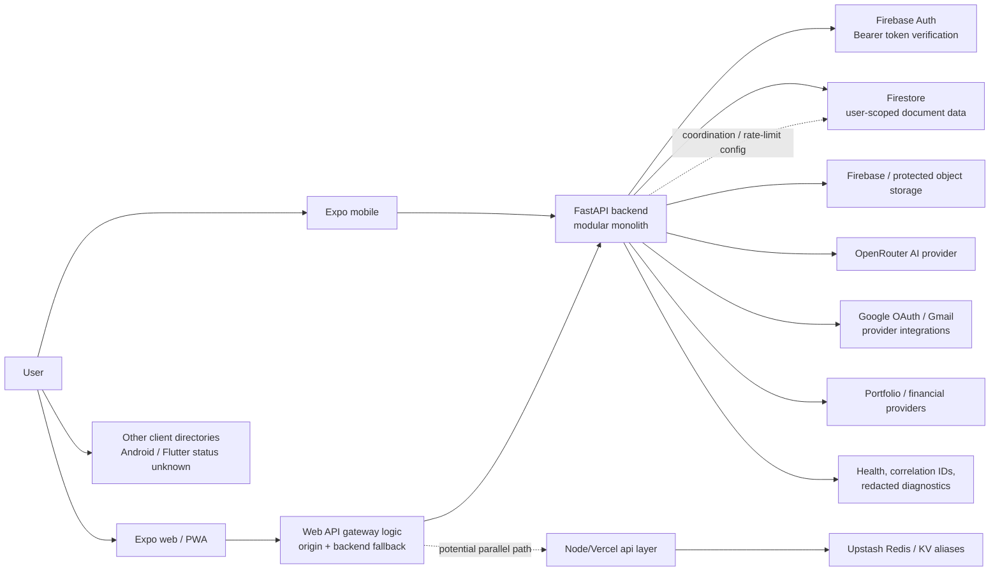

# MoneyKai: Current-to-Target Architecture Review

**Date:** 24 August 2026

**Decision status:** Accepted as the remediation baseline; live progress is tracked in `architecture-remediation-ledger.md`
**Scope:** Architecture, security, reliability, data, API, AI, and delivery evolution for MoneyKai.

## How to read this review

This is an evidence-led design review, not a claim that every planned capability is already live. Each substantive conclusion is marked as one of:

- **[Confirmed]** Directly evidenced in the MoneyKai repositories or configuration.
- **[Inference]** A reasonable conclusion from the evidence; validate it before committing budget or an irreversible design.
- **[Missing information]** Important input that was not available.
- **[Recommendation]** A proposed decision or next action.

The requested Nike Digital Architecture reference PDF was not supplied with this review. Therefore, this document does **not** attribute any architecture, numbers, or practices to Nike. The comparison section identifies the categories that should be compared once that source is available and uses only general product-engineering patterns as a benchmark.

## Executive verdict

MoneyKai already has a sound early-stage foundation: managed Firebase identity and data services, a FastAPI backend organised into domain routers and services, Firestore-backed user isolation, idempotent mutation handling, correlation IDs, guarded AI settings, and Redis-compatible caching/rate-limit infrastructure. These are stronger foundations than a typical prototype. **[Confirmed]**

The immediate architectural risk is not scale. It is **runtime and ownership ambiguity**: the workspace contains a Node/Vercel `api/` implementation while the workspace README describes the sibling FastAPI repository as the production backend; the web client can fall back between origins. This can create inconsistent authentication, AI safeguards, rate limits, password-management behaviour, logging, and incident response if it remains unresolved. **[Confirmed]**

The optimal next architecture is a **modular monolith with explicit domain boundaries**, with FastAPI as the canonical API/BFF, Firebase as identity and primary document data platform, Storage for protected artifacts, Redis only for non-authoritative low-latency concerns, and a managed task queue for genuinely asynchronous work. Do not introduce microservices, Kafka, a data lake, or a full RAG/LangGraph platform yet. **[Recommendation]**

The first investment should be: establish one authoritative API path; make contracts and observability reliable; model background tasks durably; then add AI only behind a policy gateway and measured product use cases. This sequence reduces security and delivery risk while preserving room to scale. **[Recommendation]**

## 1. Business and operating assumptions

The following assumptions make the plan actionable. They are not facts and must be replaced by measured business data before a production capacity or compliance commitment.

| Item | Working assumption | Confidence | Why it matters |
|---|---|---:|---|
| Product | Consumer personal-finance and budgeting product with optional shared/group, document, portfolio, and AI-assisted experiences. | Medium | Determines tenant boundaries and data sensitivity. |
| Primary users | India-first individual users; users may connect email, financial data, or portfolio providers. | Medium | Affects privacy notices, data residency, provider risk, and currency/localisation. |
| Stage | Pre-PMF to early growth, with low-to-moderate and bursty traffic rather than Nike-scale global demand. | Low | Supports a modular-monolith decision. |
| Initial capacity band | Plan operationally for 1k–10k DAU, normal API traffic under 30 RPS and launch bursts up to roughly 200 RPS. | Low | These are test bands, not observed traffic. |
| Availability target | 99.9% monthly availability for authentication and data mutations; AI/enrichment may degrade gracefully. | Recommendation | Separates core money-record workflows from optional features. |
| Financial regulation | MoneyKai stores sensitive financial information but is not assumed to initiate payments, hold funds, or operate as a regulated account aggregator. | Missing information | If any of these assumptions are false, legal/compliance architecture changes materially. |

### Decisions that require founder/product confirmation

1. Which client applications are actively supported: Expo mobile, Expo web, Android, Flutter, or a subset?
2. Does MoneyKai ever fetch bank-account, payment, or account-aggregator data, or only user-provided/provider-authorised records?
3. What countries, data-residency requirements, and user age requirements apply at launch?
4. What is the source of truth for a transaction: manual entry, imported data, provider sync, or several sources with reconciliation?
5. Which AI jobs are allowed to send user content to an external model provider, and which require explicit consent?
6. What are the actual DAU, peak RPS, p95 latency, budget, and expected growth over the next 12 months?

## 2. Current-system reconstruction

### 2.1 Confirmed current architecture

- **[Confirmed] Client surfaces:** the workspace contains an Expo Router mobile application, an Expo Router web application, an Android directory, and a Flutter directory. Their respective release ownership and production status are not evident from the workspace README.
- **[Confirmed] Primary backend direction:** `README.md` identifies `../MoneyKai-backend` as the FastAPI + Firestore backend and states that the frontend uses `EXPO_PUBLIC_BACKEND_BASE_URL` to reach it.
- **[Confirmed] Browser configuration:** the web environment configuration defaults production API traffic to `https://money-kai-backend.vercel.app`, with a local development fallback.
- **[Confirmed] Backend modules:** FastAPI composes routes for auth, AI, capture, capabilities, Gmail, financial documents, financial AI, portfolio, reconciliation, bootstrap, diagnostics, resources, security, news, challenges, groups, settings, backups, and cron.
- **[Confirmed] Identity:** backend requests use Firebase bearer-token verification; the verified token establishes the authenticated user identity.
- **[Confirmed] Data isolation:** Firestore persistence is arranged under user-scoped collections and includes resources, groups, provider connections/secrets, portfolio data, reconciliation records, audit events, Gmail connections, email/document records, and more.
- **[Confirmed] Mutation safety:** a Firestore-capable coordination store and idempotent-mutation service are present, including receipt/replay/conflict handling.
- **[Confirmed] AI guardrails already exist:** OpenRouter configuration includes model allow-listing, request timeout, input/output limits, attachment restrictions, retention controls, and request rate limits. AI prompt/response storage defaults are configured to be conservative.
- **[Confirmed] Operational foundations:** correlation-ID middleware, protected diagnostics with redaction, health endpoints, security tests, and local/in-process periodic attachment cleanup exist.
- **[Confirmed] Redis/Upstash capability:** a Node/Vercel API layer contains Upstash Redis configuration and cache/rate-limit support; the backend also has coordination/rate-limit configuration. Runtime ownership for these paths is not yet singular.
- **[Confirmed] Parallel server paths:** the workspace contains a `api/` Node/Vercel serverless layer for auth, Redis, and AI-related code in addition to the declared FastAPI backend. This is an architectural fact, not proof that both are currently serving production traffic.

### 2.2 Current architecture diagram



### 2.3 Architectural interpretation

The current shape is best described as a **managed-services modular monolith in transition**, not a microservice estate. FastAPI has multiple domain routers but is one deployable application sharing operational concerns and Firestore persistence. That is appropriate at this stage. **[Inference]**

The main uncertainty is whether legacy/serverless Node routes are a compatibility layer, a current production route, or an unfinished migration. The answer must be made explicit in deployment documentation, client configuration, and ownership. **[Missing information]**

## 3. Nike-reference comparison matrix

The requested reference itself is unavailable, so the “reference” column intentionally does not assert Nike facts. On receipt of the PDF, replace every “not assessed” entry with source page/section citations and re-evaluate the decision.

| Architecture concern | MoneyKai evidence | Nike-reference status | General benchmark relevance | Recommended MoneyKai position |
|---|---|---|---|---|
| Global edge delivery | Expo web and Vercel-oriented deployment are evident. | Not assessed; PDF missing. | High for public marketing/static content. | Use CDN/edge cache for public assets only. |
| Client platform | Multiple client directories exist. | Not assessed. | High. | Publish an active-client support matrix and shared API contract. |
| API gateway/BFF | FastAPI backend plus Node/Vercel path creates ambiguity. | Not assessed. | High. | One canonical FastAPI `/v1` BFF/API. |
| Microservices | No independent deployable domain services are evidenced. | Not assessed. | Low now. | Remain modular monolith. |
| Event streaming | No managed event bus is evidenced. | Not assessed. | Medium for async ingestion. | Start with task records + queue; no Kafka. |
| Data platform | Firestore is primary documented store. | Not assessed. | High. | Keep Firestore authoritative; add derived exports only when justified. |
| Identity | Firebase token verification is implemented. | Not assessed. | High. | Preserve managed identity; centralise authz in FastAPI. |
| Personalisation/AI | OpenRouter gateway/configuration and financial AI routes exist. | Not assessed. | Medium. | Add policy, consent, evaluation, and scoped retrieval before agent frameworks. |
| Observability | Correlation IDs and diagnostics exist; production telemetry maturity is unproven. | Not assessed. | High. | Adopt traces, metrics, SLOs, alerts. |
| Regional resilience | Hosting and data regions are not documented. | Not assessed. | Medium. | One primary region, backups, restore drills; defer multi-region writes. |
| Security controls | Auth, redaction, limits, and idempotency exist. | Not assessed. | High. | Close runtime boundary and create data-classification/control plane. |
| Experimentation | Feature flags are present in backend settings. | Not assessed. | Medium. | Formalise auditable feature-flag lifecycle. |
| Commerce/entitlements | Pricing plans exist in product discussion, but billing architecture is not evidenced. | Not assessed. | Medium. | Keep entitlements separate from financial records. |
| Organisational scale | Small product team is assumed. | Not assessed. | High. | Optimise for low operational burden and fast safe change. |

## 4. Findings register

| ID | Priority | Classification | Finding, evidence, and root cause | User/business impact | Recommendation | Validation / rollback |
|---|---:|---|---|---|---|---|
| F-01 | P0 | Confirmed | **Two server-side paths need a single owner.** The workspace has Node/Vercel `api/` auth/AI/Redis code, while README declares FastAPI production backend; web configuration supports backend routing/fallback. Root cause: an incomplete or undocumented migration boundary. | Inconsistent auth, password changes, AI rules, limits, logs, and incident handling. | Declare FastAPI the authoritative `/v1` API. Inventory Node routes; migrate, proxy temporarily, or retire each through an explicit deprecation schedule. | Contract-test each route. Roll back with a route-level feature flag/base URL switch. |
| F-02 | P0 | Recommendation | **A durable async-work model is needed before heavy integrations grow.** In-process periodic cleanup exists; long-running provider/document/AI work may otherwise run in request paths or lack durable retry. | Timeouts, duplicate processing, untraceable failures, delayed user results. | Introduce task records plus one managed queue only for non-interactive work. | Launch behind job type flags; retain synchronous path for a limited rollback window. |
| F-03 | P1 | Confirmed / inference | **Domain boundaries are logical but persistence ownership is broad.** One Firestore service touches several business areas. | Harder safe change and reporting/reconciliation correctness risks as features grow. | Create domain repositories/interfaces and a canonical ledger model; do not split services yet. | Contract and invariant tests per domain. |
| F-04 | P1 | Missing information | **Production observability is not proven.** Correlation and redacted diagnostics are present, but repository evidence does not establish distributed traces, metrics, SLOs, or alerting. | Slow detection and costly incident diagnosis. | Add OpenTelemetry-compatible traces, redacted structured logs, golden-signal metrics, and alert runbooks. | Fault-injection and synthetic checks; disable exporters safely if needed. |
| F-05 | P1 | Confirmed | **AI safeguards exist but are not yet a complete AI control plane.** Limits, model allow lists and retention controls exist; consent, policy versioning, evaluation, retrieval authorisation and provider-boundary proof are not evidenced. | Privacy leakage, unsafe advice, unpredictable cost/quality. | Centralise AI access behind FastAPI policy gateway; add consent, redaction, tool allow lists, evaluations, and audit events. | Shadow/evaluation mode; kill switch for every AI capability. |
| F-06 | P1 | Inference | **Client feature drift is likely unless ownership is explicit.** Expo mobile/web plus Android and Flutter directories exist. | Divergent user experience and higher security/test burden. | Select active clients, assign owners, and generate clients/types from OpenAPI. | Versioned contract compatibility checks. |
| F-07 | P1 | Recommendation | **Caching must be explicit and non-authoritative.** Redis/Upstash capability is present but policy ownership is not singular. | Stale balances or leaked user data if cache keys/scopes are wrong. | Cache only derived, scoped reads; never make Redis the source of financial truth. | Cache-bypass flag and per-user keys/TTL tests. |
| F-08 | P1 | Missing information | **Recovery objectives and residency are unspecified.** Backups routes exist, but RPO/RTO, restore drills, and service regions are not established. | Inability to recover confidently from data loss or provider outage. | Define initial RPO/RTO; schedule encrypted backups and restore exercises. | Quarterly restore test with evidence. |
| F-09 | P2 | Recommendation | **API contracts should become a product boundary.** FastAPI has versioned routing potential, but generated and published client contracts are not evidenced. | Breaking changes across web/mobile and parallel server paths. | Publish OpenAPI, generate typed client package, standardise error/idempotency envelopes. | CI contract diff gates; old API version remains until migration complete. |
| F-10 | P2 | Recommendation | **Financial lineage needs explicit invariants.** The product contains capture, resources, portfolios and reconciliation routes. | Conflicting totals, audit gaps, difficulty explaining balances. | Define canonical transaction, source, import, adjustment, and reconciliation state models. | Reconciliation reports and immutable audit events. |

## 5. Target architecture

### 5.1 Target principles

1. **One authoritative request path:** browser and mobile traffic reach FastAPI `/v1`; no user feature has two competing server implementations.
2. **Modular monolith first:** packages and modules can evolve independently inside one deployable application; extraction happens only when operational evidence demands it.
3. **Data is tenant-scoped by construction:** every data access starts with an authenticated user/tenant context and applies server-side ownership checks.
4. **Money data is explainable:** derived balances are reproducible from canonical records, source imports, adjustments, and reconciliation history.
5. **Async work is durable and idempotent:** a request may create work, but workers complete it from a durable task state.
6. **AI is optional, constrained, observable and reversible:** it never becomes the authority for balances, compliance decisions, or irreversible financial actions.
7. **Managed infrastructure over bespoke operations:** use Firebase/Firestore, object storage, a managed task system, and hosted telemetry before operating clusters.

### 5.2 Target logical diagram

```mermaid
flowchart TB
  subgraph Clients
    WEB[Expo Web / public site]
    MOB[Expo Mobile]
    OTHER[Supported client releases only]
  end

  WEB --> EDGE[CDN / WAF / rate policy]
  MOB --> API
  OTHER --> API
  EDGE --> API[FastAPI canonical API / BFF\n/v1]

  API --> ID[Firebase Auth verification]
  API --> MODS[Domain modules\nIdentity | Ledger | Budget | Connections\nDocuments | Reports | AI | Settings]
  MODS --> DB[(Firestore\nAuthoritative tenant data)]
  MODS --> OBJ[(Protected object storage)]
  MODS --> CACHE[(Redis\ncache + rate limits only)]
  MODS --> TASKS[(Task records + managed queue)]

  TASKS --> WORKERS[Worker handlers\nimports, documents, summaries, cleanup]
  WORKERS --> DB
  WORKERS --> EXT[OAuth / Gmail / portfolio providers]
  MODS --> AIGW[AI policy gateway]
  AIGW --> OR[OpenRouter]

  API --> TEL[Tracing, metrics, redacted logs, audit events]
  WORKERS --> TEL
```

### 5.3 What deliberately does not belong in the target yet

- No Kubernetes, service mesh, Kafka, Kinesis, Elasticsearch, data lake, or multi-region active-active writes.
- No microservice extraction merely because domains have names.
- No generic “agent” permitted to call financial-provider, storage, or mutation endpoints directly.
- No cross-user semantic search or shared vector index for private financial documents.
- No Redis cache of bearer tokens, unencrypted provider credentials, or canonical balances.

## 6. API, identity, and authorisation redesign

### Canonical API contract

- **[Recommendation]** Keep REST as the primary contract. FastAPI produces OpenAPI from source; publish a versioned schema (`/v1/openapi.json`) and generate TypeScript client/types used by Expo web/mobile.
- **[Recommendation]** Use a consistent envelope: `requestId`, machine-readable `code`, safe user message, optional field errors, and `retryable` flag. Never return internal provider errors or secrets.
- **[Recommendation]** Require `Idempotency-Key` for every mutation that can create/update financial records, start imports, trigger jobs, upload documents, or change security-sensitive settings.
- **[Recommendation]** Version only when contract compatibility cannot be preserved. Maintain an explicit deprecation date and telemetry for usage before removing `/v1` fields/endpoints.

### Identity and access rules

- **[Confirmed]** Firebase bearer-token verification is the current backend authentication boundary and should remain the identity authority.
- **[Recommendation]** FastAPI, not a browser or duplicate server route, decides authorisation from token + resource ownership. Firebase custom claims should be reserved for stable coarse roles such as support/admin and never replace per-resource checks.
- **[Recommendation]** Re-authentication is mandatory for password change, connected-provider credential change, export/delete account, and recovery settings. The client should never handle Firebase admin credentials or provider secrets.
- **[Recommendation]** Use OAuth PKCE/state/nonce, encrypted-at-rest refresh tokens, exact redirect URI allow lists, least scopes, connection revocation, and token-rotation procedures for Google/Gmail and other providers.

### Domain modules and boundaries

| Module | Owns | Must not own |
|---|---|---|
| Identity & profile | User profile, consent, preferences, authenticated session interpretation | Provider sync or financial calculations |
| Ledger | Canonical transactions, source links, categorisation, adjustments, audit trail | Raw provider OAuth secrets |
| Budget & goals | Budget configuration, goal progress, derived budget views | Rewriting canonical transaction history |
| Connections & ingestion | OAuth connections, import cursors, provider sync task state | Directly changing a reconciled transaction without ledger command |
| Documents | Protected artifacts, parsing state, retention/deletion | Broad user search across tenants |
| Reports | Derived, cacheable report views and saved report definitions | Authoritative transaction mutation |
| AI | Policy, prompt assembly, allowed tools, redaction, evaluation and AI audit metadata | Direct database writes or unrestricted external network calls |
| Settings & security | User settings, session/security actions, account lifecycle | Domain-specific financial rules |

## 7. Data, event, and job design

### Data classification

| Class | Examples | Rules |
|---|---|---|
| Restricted | OAuth refresh tokens, financial documents, exports, encryption material | Encrypt at rest, strict server-only access, minimal retention, no AI submission without consent/policy. |
| Sensitive | Financial transactions, balances, budgets, user identity/contact data | Tenant-scoped access, audit important reads/changes, no public caching. |
| Internal | Operational task state, redacted diagnostics, feature flags | Access-controlled, retention-defined, avoid raw user content. |
| Public | Marketing assets and public documentation | CDN cacheable, integrity/versioning controls. |

### Canonical money-record model

**[Recommendation]** Define one canonical transaction identity and preserve its history:

- Immutable base attributes: `transactionId`, owner/tenant, source, source record ID, occurred timestamp, created timestamp, amount/currency, direction, and ingestion/version metadata.
- Mutable views: category, user note, review status, linked budget/group allocation, and display metadata.
- Corrections: represented as an adjustment or a versioned update with actor, reason and timestamps—not silent destructive replacement.
- Reconciliation: records a comparison between source/import result and MoneyKai state, with a review outcome; it does not obscure the original source record.
- Every derived balance/report records its calculation version, data horizon, and generated timestamp.

### Events and asynchronous jobs

Do not create a general streaming platform first. Implement a durable task pattern:

1. The API validates/authenticates a request and commits the domain change/task record atomically where possible.
2. A task has `taskId`, owner, type, input reference (not unnecessary raw PII), idempotency key, attempt count, state, timestamps and last safe error code.
3. A managed queue delivers work to a handler. The handler is idempotent and records completion before acknowledging when the provider supports that pattern.
4. Retries use bounded exponential backoff; terminal failures go to a reviewable dead-letter state after a defined maximum (initially five attempts is reasonable).
5. Users see a clear pending/completed/failed state rather than a spinner that implies synchronous completion.
6. An internal event log can initially be a Firestore collection written from domain commands. Add a dedicated event broker only when multiple independently deployed consumers, ordering requirements, or throughput measurements justify it.

Initial job candidates: Gmail/connection sync, document parsing, import/reconciliation, AI summarisation, export creation, retention cleanup, and backup verification. Password changes and ordinary manual transaction edits remain synchronous.

## 8. AI, LangChain, LangGraph, and RAG position

### Product position

OpenRouter is a model-provider gateway, not an architecture by itself. MoneyKai should add AI only where it can provide an explanation, classification, summary, or guided workflow while the deterministic product system remains authoritative. **[Recommendation]**

### Guardrail-first AI gateway

Every AI request goes through one backend-owned `AI policy gateway` that performs:

1. Authentication, user consent, feature entitlement, and rate/cost quota checks.
2. Data minimisation and field-level redaction before any external-provider call.
3. Use-case/model allow-listing; no client-provided arbitrary model, system prompt, URL, tool, or retrieval scope.
4. Prompt/template versioning and immutable audit metadata: user, capability, policy version, model, token/cost estimate, outcome class, and correlation ID. Store raw content only when a product-approved retention setting permits it.
5. Structured outputs validated against server schemas; numerical claims derive from application data and display source/date context.
6. Refusal and escalation paths for unsupported financial, legal, tax, or investment advice; the assistant must not claim professional advice or execute transfers/actions.
7. A per-capability kill switch, provider outage fallback, evaluation suite, and human review path for unsafe or low-confidence results.

### Framework decision

| Technology | Use now? | Decision |
|---|---|---|
| OpenRouter provider abstraction | Yes | Retain it behind the backend gateway. |
| LangChain | Not by default | Add only if its document loaders, output parsers, or provider adapters demonstrably remove custom maintenance without weakening policy enforcement. |
| LangGraph | Later, capability-specific | Consider for bounded, auditable multi-step workflows such as document intake → extraction → validation → user review. Do not use it as an autonomous financial agent. |
| RAG/vector search | Later, private and scoped | Use only for a clear user need such as citing the user’s own uploaded financial documents. Require per-user isolation, encrypted storage, deletion propagation, retrieval filters, and citations. |
| Generic autonomous agents | No | Unsafe and unnecessary for a finance product before controls, evaluation, and human confirmation are mature. |

### RAG readiness gate

Do not start RAG implementation until all are true:

- The product has a defined question that cannot be solved by structured ledger/report data alone.
- Users consent to document indexing and understand retention/deletion behaviour.
- Retrieval is strictly filtered by authenticated user and document permissions before semantic ranking.
- Chunks, embeddings, and derived metadata obey deletion/export requirements.
- The answer cites retrieved source documents and distinguishes document content from MoneyKai-generated inference.
- An offline test set measures retrieval precision, grounded-answer quality, privacy isolation, latency, and cost.

## 9. Performance, scalability, reliability, and cost model

### Initial service objectives

| Service path | Target | Degradation behaviour |
|---|---|---|
| Auth and authenticated API reads | p95 under 500 ms excluding third parties | Clear retryable error; no silent sign-out. |
| Financial mutations | p95 under 800 ms when no provider call is required | Idempotent retry; preserve receipt status. |
| Provider/document/AI work | Asynchronous by default | User sees task status and can retry safely. |
| AI interactive response | Time-bounded by configured provider timeout | Safe message plus optional non-AI alternative. |
| Backup/restore | Initial working target: RPO 24 hours, RTO 4 hours | Replace with agreed business objectives. |

### Capacity and cost practices

- Measure before scaling: request count, p50/p95/p99 latency, error rate, Firestore reads/writes, storage bytes, queue age, provider latency, AI tokens/cost, and cache hit rate.
- Apply per-user and per-capability quotas to expensive AI, export, document and integration paths; quotas are product controls as well as cost controls.
- Cache derived reports/news/public content with explicit tenant-safe keys and TTLs. Cache misses must always fall back to authoritative data.
- Paginate queries, use time windows and Firestore indexes intentionally. Track expensive query shapes before adding another database.
- Prefer one primary region and managed-service regional choices aligned with legal/business decisions. Multi-region active-active writes introduce conflict costs that are not justified now.

## 10. Security and privacy review

### Strengths already visible

- Firebase bearer token verification on the backend. **[Confirmed]**
- User-scoped Firestore data organisation. **[Confirmed]**
- Idempotent mutation infrastructure. **[Confirmed]**
- Correlation IDs and redacted diagnostics. **[Confirmed]**
- Configurable AI model, size, rate and retention controls. **[Confirmed]**

### Required hardening

| Control | Required action |
|---|---|
| Secrets | Store only in hosting secrets manager; rotate Firebase service credentials, OpenRouter, OAuth and Redis secrets; detect committed secrets in CI. |
| Server boundary | Complete F-01 so auth/AI/Redis security policy is implemented once, not twice. |
| Tenant enforcement | Add ownership checks at every repository/service command; test cross-user access attempts. |
| Object storage | Use private buckets, short-lived signed access where needed, content-type/size validation, malware scanning strategy for uploads, retention lifecycle, and deletion propagation. |
| OAuth | PKCE/state/nonce, exact redirects, encrypted refresh tokens, minimal scopes, revoke/disconnect paths, provider webhook signature verification where applicable. |
| API abuse | WAF/bot protection, route/per-user rate limits, idempotency, request-size limits, CORS allow list, security headers, and audit alerts for anomalous activity. |
| AI | Policy gateway, redaction, permission-filtered retrieval, tool allow lists, model allow lists, structured-output validation, evaluation and kill switches. |
| Privacy | Data inventory, consent records, purpose limitation, export/delete workflow, retention schedule, vendor DPAs, and privacy-policy alignment. |
| Supply chain | Pin CI actions by full SHA, dependency updates/scans, signed build provenance where platform support allows, and protected branch/review rules. |
| Incident response | Written owner/on-call escalation, credential-revocation runbook, provider outage runbook, data-breach decision tree, backup restore runbook, and tabletop drills. |

### Threat-model priorities

1. Broken object-level authorisation exposing another user’s financial records.
2. OAuth token or uploaded document disclosure.
3. Duplicate/malformed imports creating incorrect balances.
4. Prompt injection via uploaded email/document content leading to tool or data leakage.
5. Cost/availability abuse of AI, exports, or provider sync paths.
6. Parallel backend routes applying different security checks.

## 11. Phased migration plan

### Phase 0 — Establish facts and decisions (1–2 weeks)

**Goal:** remove uncertainty before changing runtime architecture.

- Inventory every public/production endpoint, domain, deployment, environment variable, client caller, data store, and third-party provider.
- Confirm the active production API route and identify each Node/Vercel `api/` route as `migrate`, `temporary proxy`, or `retire`.
- Confirm active client applications, legal/data-residency needs, actual traffic, recovery objectives, and AI consent policy.
- Publish the OpenAPI baseline, data classification, asset/secret inventory, and a simple system context diagram.
- Add route-level health/synthetic checks and a change-freeze policy for duplicate endpoint creation.

**Exit criteria:** a signed architecture decision records FastAPI as canonical API (or explicitly chooses another), and no team member needs to guess where a user request is handled.

### Phase 1 — Make the core path trustworthy (2–4 weeks)

**Goal:** unify request handling without breaking users.

- Move or proxy legacy Node behaviours behind the FastAPI canonical contract; use feature flags and telemetry to measure route migration.
- Standardise authentication/authorisation middleware, correlation IDs, error envelope, idempotency requirements, CORS/security headers, and rate-limit policy.
- Generate typed API clients for supported web/mobile applications.
- Define canonical transaction and reconciliation invariants; add contract, ownership, and idempotency tests.
- Establish secrets rotation runbook and ensure production configuration has no unsafe local fallback.

**Exit criteria:** every user-facing feature has one production API implementation, contract checks pass, and a rollback switch is tested.

### Phase 2 — Durable integrations and operational visibility (3–6 weeks)

**Goal:** make slow/failable work dependable and observable.

- Introduce task records and one managed queue/worker mechanism; begin with document, provider sync, export and cleanup jobs.
- Implement bounded retries, idempotent handlers, dead-letter review, user-visible task status, and manual replay controls.
- Add traces, redacted structured logs, metrics dashboards, SLOs, alerts, synthetic checks, and incident runbooks.
- Define cache policy and Redis ownership; enforce tenant-safe keys and cache-bypass controls.
- Run backup restore drill and document actual RPO/RTO.

**Exit criteria:** a deliberately failed task is retried or safely surfaced, queue age is observable, and a restore exercise succeeds.

### Phase 3 — Governed AI capabilities (3–6 weeks)

**Goal:** ship a useful AI capability without making AI a security or correctness dependency.

- Create the backend AI policy gateway and consolidate all OpenRouter access behind it.
- Select one bounded feature, such as explanation of a precomputed budget trend or user-approved categorisation suggestion.
- Add consent, model/capability allow lists, redaction, quota controls, structured outputs, safety messaging, evaluation fixtures, audit metadata and kill switches.
- Establish offline quality/cost/privacy evaluations and production monitoring before expanding use cases.
- Assess LangChain/LangGraph only against a concrete workflow; retain simple custom orchestration if it is clearer and safer.

**Exit criteria:** the capability has measured value, a failure/abuse drill, and a product owner-approved safety/evaluation record.

### Phase 4 — Private retrieval and scale-out only when earned (ongoing)

**Goal:** extend capabilities based on measured need.

- If the RAG readiness gate passes, build a per-user document indexing pipeline with deletion propagation and cited answers.
- If complex bounded workflows are proven, introduce LangGraph with explicit nodes, state schemas, human approval gates, timeouts, and no unconstrained tools.
- Extract a module into a separate service only when independent release cadence, scaling, data ownership, or fault isolation is demonstrated by metrics and team capacity.
- Add read models/warehouse/streaming only when product analytics or high-volume integration demands cannot be met by the modular monolith.

**Exit criteria:** each added platform component has a named owner, measurable SLO, documented cost, security review, and rollback/removal path.

## 12. Delivery backlog

### Now — highest leverage

1. Approve ADR-001 (canonical API owner) and complete endpoint/deployment inventory.
2. Add OpenAPI publication, generated typed client, API contract-diff CI, and consistent errors/idempotency.
3. Close duplicate Node/FastAPI routes through migration/proxy/removal plan.
4. Add tenant-isolation, authz, mutation-replay and cross-client contract tests.
5. Implement telemetry baseline: traces, metrics, redacted logs, dashboard, alerts, and synthetic checks.
6. Decide active client matrix; stop shipping unmanaged duplicate clients.

### Next — reliability and security

1. Durable task records, queue, worker, DLQ and user task status.
2. Canonical transaction/reconciliation schema and audit/event rules.
3. Data classification, retention schedule, export/delete flow, and provider/OAuth security runbooks.
4. Redis cache/rate-limit policy with one runtime owner.
5. Backup/export restore exercise and incident tabletop.

### Later — conditional product acceleration

1. AI policy gateway and one bounded, measured AI feature.
2. RAG only after the readiness gate, with private scoped retrieval/citations.
3. LangGraph only for an evidenced multi-step workflow requiring durable orchestration.
4. Service extraction, data warehouse, stream platform, or multi-region design only when operational evidence warrants it.

### Explicitly do not do now

- Build a Nike-scale microservice/data-streaming architecture.
- Implement autonomous trading, financial advice, or money-moving agents.
- Add vector search simply because RAG is fashionable.
- Migrate away from Firestore before query, consistency, cost, or reporting limits are measured.
- Support every existing client directory without a release owner and test plan.

## 13. Architecture decision records

### ADR-001: FastAPI is the canonical user-facing API/BFF

- **Status:** Proposed, urgent.
- **Context:** FastAPI is declared production backend, but Node/Vercel API code remains in the workspace.
- **Decision:** New user-facing endpoints are implemented in FastAPI `/v1`. Each Node route gets an owner and one disposition: migrate, temporary proxy, or retire.
- **Consequences:** one security/observability policy; short-term migration work; clearer deployment ownership.

### ADR-002: Retain a modular monolith

- **Status:** Proposed.
- **Decision:** Keep domain modules in one FastAPI deployable with explicit repository/service contracts.
- **Consequences:** low operational load and fast delivery; extraction is deferred until measured need.

### ADR-003: Firestore remains the authoritative operational store

- **Status:** Proposed.
- **Decision:** Keep Firestore as primary user/operational data source and Firebase/protected storage for artifacts.
- **Consequences:** design indexes/query patterns intentionally; add a separate store only with demonstrated requirements.

### ADR-004: Redis is non-authoritative

- **Status:** Proposed.
- **Decision:** Use Redis/Upstash for cache, quotas, transient locks and rate limits—not canonical financial data or long-lived secrets.

### ADR-005: Async work uses task records plus one managed queue

- **Status:** Proposed.
- **Decision:** Introduce durable idempotent jobs for slow integration/document/AI work; no generic event-streaming platform initially.

### ADR-006: AI is backend-gated and non-authoritative

- **Status:** Proposed.
- **Decision:** OpenRouter calls pass through the policy gateway; LangChain/LangGraph/RAG are capability-specific optional implementations, never client-side infrastructure.

### ADR-007: Contract-first supported clients

- **Status:** Proposed.
- **Decision:** Publish OpenAPI and generated client types; maintain an explicit support/lifecycle matrix for web and mobile clients.

### ADR-008: Security and recovery are release requirements

- **Status:** Proposed.
- **Decision:** no high-risk provider, AI, or data feature launches without threat-model review, privacy/retention decision, telemetry, rollback, and restore evidence.

## 14. Final priorities and scorecard

### Priority order

1. **Eliminate duplicate server-path ambiguity.**
2. **Make finance mutations and API contracts consistently safe.**
3. **Add durable jobs and operating visibility.**
4. **Formalise privacy, retention, backups, and incident response.**
5. **Ship one guarded AI use case, then measure before adding frameworks or RAG.**

### Current maturity scores (evidence-based, not an audit certification)

| Area | Score / 5 | Rationale |
|---|---:|---|
| Product architecture | 3.0 | Good managed modular-monolith base; server ownership ambiguity must close. |
| Identity and application security | 3.0 | Firebase verification, limits and redaction exist; centralisation and proof of controls needed. |
| Data correctness | 2.5 | Idempotency/reconciliation concepts exist; canonical ledger invariants need formalisation. |
| Reliability and operations | 2.0 | Health/correlation/diagnostics exist; queues, SLOs, telemetry and restore evidence are missing/unproven. |
| Scalability | 3.0 | Managed services provide headroom; measured capacity/query/cache strategy is needed. |
| AI readiness | 2.5 | Provider abstraction and basic guardrails exist; governance/evaluation and clear use cases are still required. |
| Delivery governance | 2.5 | Tests and CI security awareness are present; contract, ADR, release and client-ownership discipline should mature. |

### Founder decision in one sentence

**Build MoneyKai as a secure, observable FastAPI modular monolith with one API owner and durable async work; earn LangGraph/RAG/microservices only through a measured user problem, not architectural aspiration.**

## Appendix A — Repository evidence reviewed

- `README.md` — repository topology and declared FastAPI backend direction.
- `apps/MoneyKai-web/src/config/environment.ts` — backend base URL configuration.
- `api/_lib/ai-runtime.js`, `api/_lib/firebase-identity.js`, `api/_lib/redis.js` — Node/Vercel parallel path capabilities.
- `../MoneyKai-backend/app/main.py` — FastAPI composition, middleware, routers and in-process cleanup.
- `../MoneyKai-backend/app/core/settings.py` — platform/security/AI configuration surface.
- `../MoneyKai-backend/app/core/security.py` — Firebase bearer-token verification.
- `../MoneyKai-backend/app/services/firestore_service.py` — user-scoped persistence areas.
- `../MoneyKai-backend` coordination/idempotency services — mutation receipts and distributed-store capability.

## Appendix B — Inputs needed for the next revision

1. The Nike Digital Architecture reference PDF or a stable link plus permission to use it.
2. Current DAU/MAU, peak request rate, latency/error data, spend limit, and 12-month growth target.
3. Production deployment map, environment inventory, Firebase project/region setup, backup settings, and active Vercel projects.
4. Supported client/release matrix and mobile/web distribution plan.
5. Data-flow inventory for Gmail, portfolio, documents, transaction sources, and AI provider submissions.
6. Legal/compliance review of financial-data scope, age/region support, terms, privacy, consent, retention and deletion commitments.
