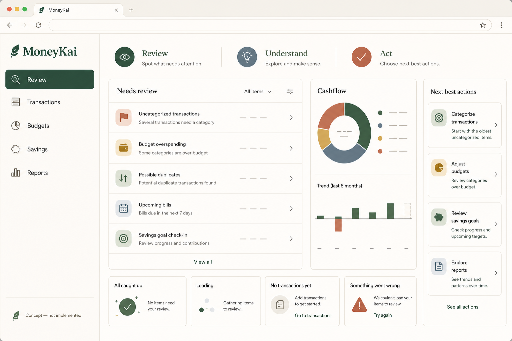
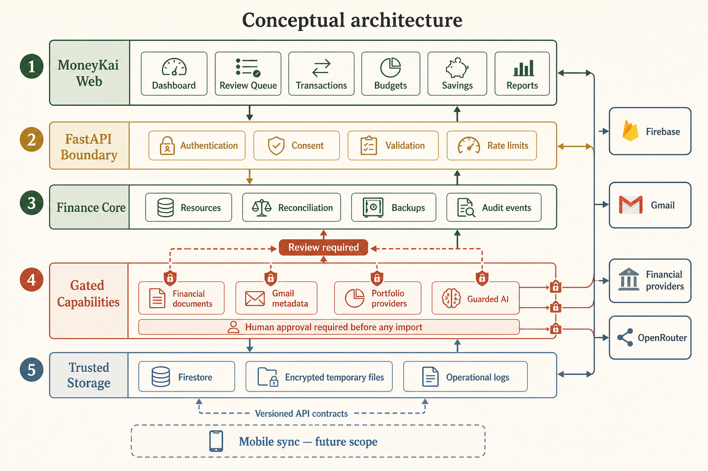
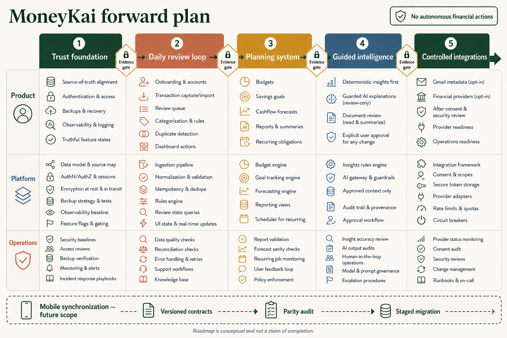

# MoneyKai Web and Backend Implementation Plan

**Plan status:** Revised after architecture and production-topology audit
**Active scope:** Expo web application and FastAPI backend
**Deferred scope:** All mobile applications and mobile synchronization
**Delivery rule:** Financial integrity and recoverability gates take precedence over feature expansion

## 0. Executive Delivery Decision

MoneyKai is not ready to scale sensitive ingestion, broker synchronization, or AI/document processing in its current topology. The product can continue improving its existing web experience, but four conditions are release-blocking for the affected capabilities:

1. Zerodha synchronization must not replace existing transactions with an empty provider result.
2. Durable financial mutations must have one backend-owned authority and must never fail silently into an unrelated browser-local state.
3. Sensitive files and quota state must move from instance-local disk, SQLite, and process memory to durable shared infrastructure.
4. Account deletion, restore, import, and provider replacement must be recoverable, idempotent, and proven under partial failure.

This plan therefore uses a **contain → consolidate → harden → scale → expand** sequence. Product-facing review, planning, AI, and integration work can proceed only after the relevant integrity gates pass.

### Confirmed Audit Findings

| ID | Severity | Confirmed condition | Required disposition |
|---|---|---|---|
| `AF-001` | Critical | Zerodha sync produces an empty transaction list and the replacement path deletes existing account transactions | Keep Zerodha transaction sync disabled until non-destructive reconciliation is implemented and tested |
| `AF-002` | Critical | Browser persistence, direct Firestore writes, backend resources, and portfolio-local fallback can each behave as a source of truth | Move durable writes behind FastAPI; retain browser state only for explicit drafts, cache, and UI preferences |
| `AF-003` | Critical | Sensitive attachments/documents use local paths while AI quotas use local SQLite or process memory on a serverless deployment | Adopt durable encrypted object storage and a distributed rate-limit/quota store |
| `AF-004` | Critical | Account/financial-data deletion removes Firestore metadata without proving deletion of stored file payloads | Introduce a deletion manifest and verified artifact purge before final metadata/account removal |
| `AF-005` | High | Restore and document-import workflows can partially commit | Introduce preflight plans, operation records, idempotency, resumability, and compensating recovery |
| `AF-006` | High | Reading portfolio state creates a persisted wealth snapshot | Separate pure reads from explicit snapshot creation |
| `AF-007` | High | Bootstrap and resource reads are unbounded and include N+1 group-expense queries | Add cursor pagination, bounded initial payloads, incremental synchronization, and measured query budgets |
| `AF-008` | High | Generic resource endpoints enforce payload safety but not domain invariants | Replace generic finance mutations with typed domain commands and versioned schemas |
| `AF-009` | High | Portfolio operations can convert auth, configuration, network, and 404 failures into local success | Restrict fallback to explicitly labelled read-only/demo or draft modes; never mask durable mutation failure |
| `AF-010` | Medium | Client and server feature gates are independently resolved and the Wealth client gate defaults open | Resolve capability status server-side and default sensitive capabilities closed |

### Release Policy

- **Core web:** May continue through ordinary quality gates when it does not depend on a blocked capability.
- **Zerodha/provider sync:** Frozen until `AF-001`, `AF-002`, `AF-005`, and provider-specific acceptance tests pass.
- **Financial-document uploads:** Internal-only until `AF-003`, `AF-004`, and deletion/retention tests pass.
- **AI attachments and paid AI calls:** Internal-only until distributed quotas, durable storage, redaction, and multi-instance tests pass.
- **Backup restore:** Must be labelled protected/beta until atomic-or-resumable recovery and restore verification pass.
- **Mobile:** Remains unchanged; no task in this plan authorizes mobile edits.

## 1. Document Purpose

This plan defines the next product and engineering direction for MoneyKai's web application and FastAPI backend. It converts the current broad feature set into a coherent, trustworthy personal-finance workflow centred on **review → understand → act**.

The plan does not authorize mobile implementation. Mobile remains unchanged for now and is treated as a future synchronization stream through versioned API contracts.

## 2. Project Foundation

### Core Vision

MoneyKai should be the calm place where a person reviews financial activity, understands what changed, and chooses the next safe action. The product should help users maintain accurate records and make deliberate planning decisions; it should not behave like an autonomous adviser or trading system.

### Problem Being Solved

The repository already contains many useful surfaces and backend capabilities, but breadth has outpaced product cohesion. Users can encounter transactions, budgets, savings, goals, groups, reports, portfolio, document parsing, Gmail, and AI as separate modules. The next stage must connect the dependable pieces into one daily loop and keep unavailable capabilities visibly gated.

### Target Users

- Individuals and households who want a dependable view of spending and cashflow.
- Users who need help cleaning, categorising, and understanding financial records.
- Users who want budgets, savings goals, and reports based on reviewed data.
- Users who value consent, privacy, reversibility, and explicit approval.

The current scope does not target active trading, lending decisions, autonomous investment advice, or enterprise accounting.

### Current Project Stage

- The web application is an Expo Router application with public marketing routes and an authenticated finance workspace.
- The backend is a separate FastAPI repository using Firebase authentication and Firestore-backed services.
- The audited web route tree includes dashboard, transactions, budgets, savings, goals, reports, accounts, groups, portfolio, settings, and guarded AI surfaces.
- The backend exposes mature route families for resources, backups, settings, reconciliation, security, Gmail, financial documents, portfolio, diagnostics, and guarded AI.
- Advanced financial capabilities are feature-flagged. Gmail, financial documents, financial AI, and backend portfolio support default to disabled unless explicitly configured.
- Manual portfolio contracts exist, while linked-account providers still require provider and consent decisions.
- Local web and backend servers run successfully, but operational readiness must be proven per feature before public enablement.

### Existing Components

**Web product**

- Authentication, password recovery/change, profile, and settings.
- Dashboard and customizable analytics workspace.
- Transactions, categories, budgets, savings, goals, and reports.
- Review-oriented analytics and spending-trend components.
- Groups, notes, notifications, subscriptions, learn centre, and public trust/security content.
- Backup/restore surfaces and consent-gated telemetry.
- Manual wealth/portfolio surfaces and provider-readiness states.
- Typed backend clients and explicit financial-feature contracts.

**Backend platform**

- Firebase identity boundary and user-scoped persistence.
- Generic financial resources and bootstrap endpoints.
- Backups, restore validation, settings, account deletion, and financial-data deletion.
- Reconciliation reviews with approve/ignore actions.
- Gmail OAuth and metadata-sync services behind feature flags.
- Financial-document parsing, password handling, review, approval, ignore, and import flows.
- Manual portfolio holdings, snapshots, connection metadata, and provider adapters.
- Guarded AI chat, transaction insights, budget coaching, attachments, document summaries, quotas, and operational status.
- Diagnostics, audit events, cron cleanup, security hardening status, and test coverage.

### Locked Decisions

- Current implementation scope is web plus backend.
- Mobile code and mobile UX remain unchanged during this plan.
- Mobile synchronization is future scope and must use versioned contracts and a parity audit.
- The backend is the source of truth for durable cloud data and provider-owned workflows.
- Imported or AI-proposed financial changes require explicit user review.
- Browser clients must not call Gmail, financial providers, or AI providers directly.
- Feature availability must be truthful; disabled or unconfigured capabilities must not appear operational.
- No autonomous financial actions, trading execution, or unsupported financial advice.

### Stable Decisions

- Expo Router and React remain the web foundation.
- FastAPI remains the backend API boundary.
- Firebase Authentication remains the identity provider.
- Firestore remains the current durable backend data store.
- `/v1` remains the current API version boundary.
- Feature flags, consent records, validation, rate limits, and audit events remain required for sensitive capabilities.

### Confirmed Constraints

- No implementation dates, budget estimates, or team assignments have been supplied.
- Gmail, linked-account, broker, and Account Aggregator rollouts depend on external provider configuration and review.
- The system contains transitional local and client-owned data paths that must be inventoried before migration.
- Advanced AI features default to disabled and must not train on or retrieve arbitrary private user data.
- Existing production-safe behavior, public marketing routes, and mobile builds must not be disrupted.
- The FastAPI backend is deployed on invocation-based serverless infrastructure; process memory and local filesystem paths are not durable shared state.
- Existing direct client Firestore access is explicitly transitional and cannot remain the durable mutation boundary.
- Current automated tests establish a healthy baseline but do not prove multi-instance behavior, interrupted restore recovery, or provider reconciliation safety.

### Success Criteria

- A user can see what needs review immediately after entering the workspace.
- Every dashboard fact is traceable to reviewed records and a defined time range.
- The same transaction is not imported or saved twice under normal retry conditions.
- Budgets, savings, cashflow, and reports use one canonical reviewed dataset.
- Empty, loading, error, disabled, and partially configured states are explicit and recoverable.
- Sensitive integrations cannot activate without their evidence gates.
- Backup, restore, deletion, audit, and recovery paths are tested before release.
- Mobile can later consume the same contracts without forcing a web/backend redesign.
- A confirmed financial mutation is represented by a backend-issued mutation receipt; a local-only draft is visibly distinguishable.
- No failed cloud write is silently treated as a completed transaction, import, sync, backup, or deletion.
- Provider synchronization never deletes canonical records merely because a provider returned an empty or partial response.
- Account and financial-data deletion produce a verifiable manifest covering database records, provider secrets, stored objects, and residual jobs.
- Personalized list and bootstrap APIs are bounded and cursor-paginated; startup cost does not grow with the complete lifetime history.
- Sensitive-capability quotas remain correct across concurrent backend instances and cold starts.

## 3. Final Requirements

### Functional Requirements

- **FR-001 — Unified review workspace:** Present unresolved work from transactions, duplicates, categories, budgets, recurring obligations, documents, and reconciliations in one prioritized queue.
- **FR-002 — Truthful capability status:** Resolve frontend flag, backend flag, provider configuration, authentication, and consent into one typed availability state.
- **FR-003 — Reviewable ingestion:** Support manual entry and approved imports through normalized drafts before durable mutation.
- **FR-004 — Data-quality controls:** Detect duplicates, missing categories, invalid values, stale records, and reconciliation conflicts.
- **FR-005 — Actionable dashboard:** Convert analytics into explainable next actions while preserving charts, bars, and dynamic values.
- **FR-006 — Planning system:** Base budgets, savings goals, recurring obligations, and cashflow projections on reviewed records.
- **FR-007 — Reporting:** Provide consistent period filters, category breakdowns, cashflow summaries, saved reports, and export boundaries.
- **FR-008 — Guarded intelligence:** Lead with deterministic insights; allow AI explanations only when enabled, sourced, bounded, and review-only.
- **FR-009 — Controlled integrations:** Gate Gmail metadata, financial documents, portfolio providers, and linked accounts behind consent and operational readiness.
- **FR-010 — Account resilience:** Provide validated backup, restore, data export/deletion, account deletion, and auditable failure handling.
- **FR-011 — Future mobile compatibility:** Stabilize versioned contracts and data ownership rules before any mobile synchronization work begins.
- **FR-012 — Mutation truthfulness:** Return a backend-confirmed mutation receipt and expose pending, confirmed, conflicted, retrying, and failed states without representing local acceptance as durable success.
- **FR-013 — Non-destructive synchronization:** Treat empty, partial, stale, or failed provider responses as synchronization evidence requiring reconciliation, never as implicit permission to delete canonical data.
- **FR-014 — Verifiable deletion:** Delete or cryptographically retire every user-owned database record, stored object, provider secret, and pending job through a manifest-backed workflow.
- **FR-015 — Explicit snapshots:** Create wealth snapshots only through explicit commands or scheduled policies; ordinary state reads remain side-effect free.

### Non-Functional Requirements

- Accessible keyboard navigation, focus management, labels, contrast, and reduced-motion behavior.
- Responsive web layouts without hiding essential actions on smaller screens.
- Idempotent imports and retry-safe backend mutations.
- Predictable p95 response targets must be established from measured baselines, not invented in this document.
- Bounded payloads, pagination, and filtered queries for growing financial histories.
- Structured error contracts and observable correlation identifiers.
- Backward-compatible API changes within `/v1`, or an explicit new version when compatibility cannot be maintained.
- Modular feature boundaries and no duplicate business rules between dashboard, reports, and transactions.
- Durable shared object storage for sensitive files; no production workflow depends on an instance-local path surviving another request.
- Distributed, atomic quota enforcement for paid or abuse-sensitive operations.
- Side-effect-free GET operations and explicit command endpoints for mutations.
- Mutation idempotency, optimistic concurrency, and operation-status retrieval for retryable workflows.
- Domain-level validation for transaction, budget, savings, group, document-import, and portfolio commands.

### User Experience Requirements

- The first workspace question is “What needs my attention?” rather than “Which module should I open?”
- Use progressive disclosure: summary first, explanation second, editing and provenance on demand.
- Always distinguish facts, suggestions, limitations, and unavailable capabilities.
- Never imply that an import, sync, backup, or AI action succeeded before backend confirmation.
- Preserve context when moving from a dashboard insight into the filtered transaction or planning view.
- Provide safe empty, loading, offline, partial, error, and retry states.

### Technical Requirements

- Define canonical types for financial records, review items, capability status, and provenance.
- Route durable mutations through typed backend clients.
- Centralize normalization, validation, duplicate detection, and reconciliation rules.
- Add idempotency identifiers to import and reconciliation mutation paths.
- Add operation identifiers and status models to restore, provider sync, deletion, and document-import paths.
- Keep provider tokens, document passwords, model keys, and server secrets backend-only.
- Maintain repository-level tests for web contracts and backend route/service behavior.
- Generate client types from the authoritative OpenAPI schema or fail CI when checked-in contracts drift.
- Remove catch-all local fallback from durable portfolio mutations; demo and offline-draft behavior must use an explicit mode.

### Business Requirements

- Improve activation and repeat use through daily review value before expanding provider breadth.
- Keep unavailable features honest to protect trust and reduce support burden.
- Treat integrations as optional accelerators, not prerequisites for the core product.
- Define monetization only after measuring which trusted workflows users repeatedly complete; pricing changes are outside this plan.

### Security and Privacy Requirements

- Authenticate every user-scoped backend route.
- Authorize every record against the authenticated user identifier.
- Record and enforce consent scope, timestamp, revocation, and provider boundaries.
- Encrypt provider credentials and sensitive temporary files.
- Minimize raw financial-document retention and verify cleanup.
- Redact logs and diagnostics; never log prompts, raw document contents, SMS bodies, tokens, or passwords.
- Require explicit approval before imported or AI-proposed data becomes canonical.
- Preserve rate limits, abuse controls, audit events, deletion, and incident-response procedures.

## 4. Assumptions and Unknowns

### Confirmed Information

- Web and backend are the active scope.
- Mobile is deferred.
- Current architecture uses Expo Router, FastAPI, Firebase Authentication, and Firestore.
- The codebase contains broad feature implementations and guarded integrations.
- Advanced provider and AI features are not universally enabled.

### Assumptions Used

- The strongest near-term product wedge is a personal financial review desk rather than a broad super-app navigation model.
- Existing transactions, budgets, savings, reports, backups, and reconciliation capabilities should be improved before new modules are added.
- Provider-specific commitments have not yet been approved.
- The plan is prioritized by dependency and risk, not calendar dates.

### Resolved by Architecture Audit

- Core transactions, notes, savings, badges, notifications, groups, settings, budgets, and linked-account display records are still directly readable/writable by the web client under transitional Firestore rules.
- The FastAPI backend also exposes durable resource and bootstrap APIs over overlapping Firestore collections.
- Portfolio-local fallback is invoked for configuration, authentication, network, and not-found failures and is used by mutation methods.
- AI attachments and financial documents are stored on local backend paths; AI quotas are split between SQLite and process memory.
- Portfolio state reads persist snapshots; list/bootstrap paths are unbounded; restore and replace workflows can partially commit.

### Items Requiring Future Validation

- Current production collection counts, size distributions, query latency, and Firestore read/write cost by user cohort.
- Whether any existing user has divergent browser-local and Firestore/backend records requiring migration reconciliation.
- Which route families have real production usage and retention.
- The final linked-account or Account Aggregator provider.
- Gmail restricted-scope verification and acceptable consent language.
- Whether manual portfolio tracking belongs in the primary web navigation after user testing.
- Measured performance baselines and service-level objectives.
- Monetization packaging and entitlement rules.

## 5. Visual Direction

### Generated Visual 1 — Review Workspace Concept



- **Represents:** The recommended consolidated web experience: review, understand, and act.
- **Purpose:** Demonstrates progressive disclosure, review-first hierarchy, dynamic analytics, next actions, and safe states.
- **Requirements addressed:** FR-001, FR-004, FR-005, FR-006, FR-007.
- **Implementation components:** Review queue, analytics selectors, action resolver, dashboard shell, truthful surface states.

### Generated Visual 2 — Guarded Architecture



- **Represents:** Browser, FastAPI boundary, finance core, gated capabilities, storage, and external-service separation.
- **Purpose:** Makes trust boundaries, consent, validation, review, and future mobile boundaries explicit.
- **Requirements addressed:** FR-002, FR-003, FR-008, FR-009, FR-010, FR-011.
- **Implementation components:** Auth dependencies, capability resolver, services, repositories, reconciliation, storage, provider adapters, audit logging.

### Generated Visual 3 — Forward Roadmap



- **Represents:** Five evidence-gated phases and the separate future mobile stream.
- **Purpose:** Prevents integration and AI work from overtaking trust, review, and planning foundations.
- **Requirements addressed:** All requirements through phased delivery.
- **Implementation components:** Product, platform, and operational deliverables per phase.

### Selected or Recommended Direction

The implementation baseline combines all three visuals. Visual 1 defines the target experience, Visual 2 defines safe system boundaries, and Visual 3 defines delivery order. These are complementary views, not competing concepts.

### Visual-to-Requirement Traceability

| Visual element | Requirement | Phase | Status |
|---|---|---|---|
| Needs-review queue | FR-001, FR-004 | Phase 2 | Confirmed direction |
| Dynamic cashflow and trend views | FR-005, FR-007 | Phases 2–3 | Confirmed direction |
| Next-best-action rail | FR-005, FR-006 | Phases 2–3 | Proposed, deterministic first |
| Empty/loading/error states | UX requirements | Phase 1 onward | Confirmed requirement |
| FastAPI trust boundary | FR-002, FR-003 | Phase 1 | Existing and retained |
| Human review gate | FR-003, FR-008, FR-009 | All ingestion phases | Locked decision |
| Gmail and providers | FR-009 | Phase 5 | Gated; not approved for immediate activation |
| Guarded AI | FR-008 | Phase 4 | Gated; review-only |
| Mobile synchronization | FR-011 | Future phase | Explicit future scope |

## 6. Proposed Solution

### Solution Overview

Create a **Money Review Desk** that aggregates unresolved financial work into one queue. Each item links to an explanation, evidence, and a safe user-controlled action. Dashboard analytics, budgets, savings, and reports read from the same reviewed data model. External ingestion and AI remain optional backend capabilities behind evidence gates.

### Feature Portfolio Recommendation

| Feature area | Current evidence | Recommendation | Disposition |
|---|---|---|---|
| Transactions and categories | Mature web surfaces and resource APIs | Make the canonical daily workflow | Invest now |
| Dashboard and analytics | Customizable dashboard and trend components exist | Refocus around review and next actions | Invest now |
| Budgets, savings, goals | Existing routes and stores | Connect to reviewed records and recurring obligations | Invest after review loop |
| Reports and exports | Existing report and saved-report routes | Standardize periods, provenance, and export truthfulness | Invest after data alignment |
| Authentication, settings, backup, deletion | Existing web/backend capabilities | Treat as release-blocking trust infrastructure | Harden first |
| Groups, notes, challenges, learn, news | Existing supporting modules | Maintain; avoid expansion until the core loop proves retention | Maintain |
| Manual portfolio | Contract and backend services exist | Keep secondary and truthful; validate user demand | Limited pilot |
| Gmail and financial documents | Substantial gated backend support exists | Pilot only after consent, storage, and operational gates | Later gated phase |
| Linked accounts, Account Aggregator, Zerodha | Provider-required states and adapters exist | Do not activate without provider/legal/security readiness | Future gated phase |
| Financial AI | Broad guarded backend services exist but default disabled | Use deterministic insights first; AI explains, never mutates | Later gated phase |
| Mobile | Multiple implementations exist | Freeze current scope; synchronize after contracts stabilize | Future scope |

### Main Components

1. Capability and source-of-truth registry.
2. Review-item model and prioritization service.
3. Transaction ingestion and normalization pipeline.
4. Reconciliation and duplicate-detection service.
5. Dashboard fact and next-action selectors.
6. Budget, goal, recurring-obligation, and reporting services.
7. Consent-gated integration adapters.
8. Guarded insight gateway.
9. Backup, deletion, audit, diagnostics, and operational controls.

### Component Responsibilities

- **Capability registry:** Combines frontend flag, backend availability, provider configuration, auth, consent, and degradation status.
- **Review service:** Produces typed, explainable, user-scoped review items with safe actions.
- **Ingestion service:** Normalizes manual and external drafts, assigns provenance, and prevents duplicate writes.
- **Finance core:** Owns canonical transactions and derived planning facts.
- **Insight service:** Generates deterministic facts first and optional bounded explanations second.
- **Integration adapters:** Encapsulate provider-specific OAuth, token handling, synchronization, and revocation.
- **Operational controls:** Own audit, telemetry, quotas, cleanup, incident signals, and rollback evidence.

### User Flow

1. User signs in or sees an explicit local/unavailable state.
2. Workspace loads capability status, bootstrap data, and unresolved review items.
3. User selects the highest-priority review item.
4. MoneyKai shows source, reason, affected records, and reversible action.
5. User approves, edits, ignores, or defers.
6. Backend validates and commits once; dependent facts are refreshed.
7. Dashboard, budget, savings, and reports reflect the confirmed change.

### System Flow

1. Web requests typed bootstrap and review data.
2. FastAPI authenticates, authorizes, validates, and rate-limits.
3. Application services read repositories and calculate review facts.
4. Optional provider data enters as drafts with provenance.
5. Reconciliation produces review items; it does not mutate canonical records automatically.
6. Approved actions commit through idempotent service methods.
7. Audit and diagnostic events record bounded metadata.

### Data Flow

`Source → Backend validation → Normalized draft → Duplicate/reconciliation checks → User review → Canonical record → Derived facts → Dashboard/planning/reporting`

### External Integrations

- Firebase: authentication and current data infrastructure.
- Gmail: metadata and approved attachment flow only after OAuth and restricted-scope readiness.
- Financial providers: backend adapters only after provider approval and consent design.
- OpenRouter: backend-only guarded explanation layer when explicitly enabled.
- Vercel: current deployment environment for web/serverless surfaces.

## 7. Technical Architecture

### Frontend Architecture

- Preserve Expo Router, but organize product behavior by finance domain rather than by screen.
- Build the review workspace from small domain modules: queue, item details, evidence, actions, facts, and status states.
- Use typed query/mutation services instead of direct persistence inside screens.
- Derive dashboard values from shared selectors used by reports and planning surfaces.
- Implement progressive rendering: shell → capability state → essential review data → secondary analytics.
- Keep marketing and authenticated workspace concerns separate.

### Backend Architecture

- Retain routers as transport adapters and move business rules into application services.
- Introduce or consolidate a review orchestration service over existing reconciliation, resources, documents, and portfolio services.
- Keep repositories user-scoped and provider-agnostic.
- Centralize idempotency, provenance, validation, optimistic concurrency, mutation receipts, and audit helpers.
- Separate commands from queries. Query services cannot persist snapshots, alter review status, or trigger provider replacement.
- Represent restore, deletion, provider sync, and multi-document imports as explicit operations with persisted status and retry semantics.
- Use synchronous execution only for bounded single-request work. Adopt a durable job mechanism before enabling workflows that can exceed request duration or require cross-request recovery.

### Database Architecture

- Preserve Firestore as the durable store during this roadmap.
- Complete the source-of-truth migration: FastAPI owns durable mutations; direct client Firestore rules become read-only during a bounded migration and are then closed for migrated collections.
- Reuse existing entities and repositories; do not duplicate transaction or review collections for individual screens.
- Store provider credentials only in encrypted backend-owned records.
- Keep derived dashboard facts recomputable unless measured performance proves a need for materialization.
- Add schema/version metadata and validation adapters for every canonical entity and backup payload.
- Use conditional writes or transaction/batch boundaries where Firestore supports them; otherwise persist an operation journal and compensating recovery state.

### AI Architecture

- AI is optional, backend-only, and disabled by default.
- Inputs must be bounded, redacted where required, and limited to approved task context.
- No private-user-data RAG, vector store, autonomous agent, or model training is approved.
- Deterministic facts and rules are calculated before an explanation is requested.
- Responses must separate facts, explanation, caveats, sources/provenance, and recommended user-controlled action.
- AI responses cannot directly mutate financial records.

### Infrastructure Architecture

- Keep the current Vercel/Firebase deployment boundary only after removing assumptions of instance affinity.
- Store sensitive temporary documents in encrypted, user-scoped object storage with TTL metadata, lifecycle cleanup, and deletion verification.
- Store AI quotas, idempotency reservations, distributed locks, and short-lived operation coordination in an atomic shared store such as managed Redis; final vendor selection requires an architecture decision record.
- Persist long-running operation state in Firestore or another durable backend store; local process memory may only cache reconstructable data.
- Preserve dependency, CI, security, build, SEO, and OWASP gates.
- Add environment-parity checks for capability flags and required secrets without printing secret values.

### API Design

- Keep versioned `/v1` resources and typed request/response models.
- Add a canonical capability-status response and a review-queue response.
- Use consistent pagination, filters, error envelopes, and correlation identifiers.
- Add idempotency keys to imports and approval mutations.
- Document retry semantics and safe conflict responses.
- Generate or verify frontend contract types from the backend schema where practical.

#### Proposed Contract Families

| Contract | Purpose | Key behavior |
|---|---|---|
| `GET /v1/capabilities` | Resolve server, provider, consent, auth, and degradation state | Sensitive features default closed and return stable reason codes |
| `GET /v1/bootstrap?cursor=...` | Bounded initial/incremental workspace hydration | Stable cursor, item/read limit, next cursor, snapshot/version metadata |
| Typed `/v1/transactions`, `/budgets`, `/savings`, `/groups` commands | Replace generic core-finance mutation dictionaries | Domain validation, idempotency, mutation receipt, conflict response |
| `/v1/operations/{operationId}` | Retrieve restore/import/sync/deletion progress | Persisted state, safe retry/cancel permissions, non-sensitive failure reason |
| Provider sync command and batch result | Stage provider observations before reconciliation | Completeness classification; empty/partial data cannot imply deletion |
| Deletion plan/status/certificate | Make deletion verifiable and resumable | Manifest counts, artifact purge state, residue verification, terminal certificate |

Exact paths may adapt to existing router conventions. The behavior and state contracts are mandatory; endpoint naming is finalized through OpenAPI review before implementation.

### Authentication and Authorisation

- Firebase token verification remains the entry boundary.
- Every service method receives authenticated user context; clients never supply authoritative owner identifiers.
- Sensitive routes require recent auth or explicit confirmation where appropriate.
- Provider consent and access scope are independent of general account authentication.

### Storage

- Firestore: canonical user-scoped finance and settings data.
- Object storage: encrypted short-lived document/attachment payloads with per-user object keys, content metadata, TTL, and lifecycle/deletion evidence.
- Distributed coordination store: quotas, idempotency claims, short-lived locks, and resumable job coordination; never the canonical financial ledger.
- Browser storage: versioned UI preferences, bounded caches, and explicitly labelled offline drafts only; never an alternative canonical cloud store.
- Backups: validated schema, documented version, bounded size, explicit restore confirmation.

### Caching

- Cache public or non-sensitive configuration only where current infrastructure supports it.
- Do not cache personalized financial responses without explicit keying, TTL, invalidation, and privacy review.
- Invalidate derived facts after approved mutations.

### Messaging and Background Processing

- Replace instance-local attachment cleanup with object-store lifecycle policies plus a reconciliation cron that verifies metadata/object consistency.
- Make provider synchronization, account deletion, restore, and large imports resumable and idempotent before public enablement.
- Introduce durable jobs when any operation spans multiple external calls, crosses a request boundary, or needs replay after instance termination; this is now a correctness trigger, not only a performance optimization.

### Monitoring and Logging

- Consent-gate frontend telemetry.
- Emit structured backend operational events with correlation IDs and redaction.
- Separate product analytics from security audit events.
- Monitor auth failures, import failures, duplicate rates, restore failures, provider status, quota pressure, and cleanup failures.
- Define alert thresholds from observed baselines.

### Deployment Architecture

- Preview deployments validate schema compatibility and feature-disabled states.
- Staging validates integrations with test accounts and non-production provider credentials.
- Production enables features independently through server and client gates.
- Rollback disables the capability first, then reverts code if necessary.

## 8. Data Design

### Main Entities

- User profile and application settings.
- Transaction and category.
- Budget and budget period.
- Savings goal/challenge and contribution.
- Group and shared expense.
- Review/reconciliation item.
- Source connection and consent record.
- Financial document and parsed review result.
- Portfolio account, holding, and snapshot.
- Backup manifest and restore result.
- Audit and diagnostic event.
- Mutation receipt and idempotency record.
- Long-running operation and operation-step journal.
- Sensitive artifact metadata and deletion manifest.
- Provider synchronization batch and reconciliation result.
- Incremental synchronization cursor.
- Server-resolved capability status.

These entities reflect existing product and backend concepts. Exact field changes require a schema inventory and contract review.

### Entity Relationships

- A user owns financial records, settings, source connections, reviews, backups, and audit scope.
- Transactions reference categories and may affect budget periods, savings actions, and report facts.
- Review items reference source drafts or canonical records and expose permitted actions.
- Source connections create provenance-bearing drafts, not direct canonical writes.
- Financial documents create parsed review rows that can become transactions or holdings only after approval.
- A mutation receipt binds one authenticated command and idempotency key to its durable result or recoverable terminal error.
- An operation journal owns ordered steps for restore, deletion, provider sync, or import and records retry/compensation state.
- Stored artifacts reference user ownership, purpose, encryption metadata, expiry, and deletion status without exposing provider credentials or raw content.
- A provider sync batch records completeness, source cursor, observed records, conflicts, and reconciliation outcome before canonical changes.

### Data Ownership

- Backend-owned: canonical cloud records, provider connections, consents, review state, sensitive documents, audit events.
- Client-owned: ephemeral UI state, filter state, and safe unsent drafts.
- Transitional ownership must be inventoried and migrated explicitly.

### Data Validation

- Validate types, currency, amount bounds, timestamps, source identity, ownership, status transitions, and duplicate signatures.
- Revalidate on the backend even when client validation succeeds.
- Reject unknown status transitions and stale approval attempts.
- Reject an empty or partial provider batch as a destructive replacement instruction.
- Require stable currency, timezone/date, amount sign/type, source, and schema-version invariants for canonical finance commands.
- Enforce state-machine transitions for operations and mutation receipts with optimistic concurrency.

### Operation State Model

```text
requested -> validating -> ready -> applying -> verifying -> completed
                  |          |         |           |
                  v          v         v           v
                rejected   cancelled  retryable   failed
```

- `completed` is terminal and requires verification evidence.
- `rejected` means no canonical mutation began.
- `retryable` preserves sufficient journal state to continue safely.
- `failed` requires a documented operator or user recovery path and cannot be presented as success.
- Repeating an idempotency key returns the existing operation/result rather than starting a second mutation.

### Mutation Receipt Contract

Every durable command response must provide, directly or through an operation resource:

- `operationId` or `mutationId`.
- `status`: pending, confirmed, conflicted, rejected, retryable, or failed.
- `resourceVersion` or other conflict token where applicable.
- `idempotencyKey` acknowledgement.
- Bounded, non-sensitive error/recovery reason when not confirmed.
- Correlation identifier for support and diagnostics.

The web client may optimistically render a pending state, but only `confirmed` may be represented as durably saved.

### Data Retention

- Current backend defaults indicate zero-day raw document retention, 24-hour AI attachment TTL, and 180-day security-audit retention.
- Treat these as configuration defaults requiring deployment verification, not compliance claims.
- Consent revocation and account deletion must trigger documented data cleanup.

### Backup and Recovery

- Version backup payloads.
- Validate the full restore plan before writing.
- Make restore outcomes explicit and auditable.
- Test corrupt, oversized, stale-version, partial-failure, and retry scenarios.

## 9. Implementation Phases

### Phase 0: Immediate Containment

**Implementation status:** Code-complete; deployment evidence pending. See [Phase 0 containment evidence](docs/phase-0-containment-evidence.md).

- **Objective:** Prevent known destructive or misleading behavior while preserving the stable core product.
- **Tasks:** Disable Zerodha transaction replacement; disable or internalize sensitive upload/AI attachment capabilities that depend on local storage; block catch-all local fallback for durable mutations; add explicit warnings to protected restore paths; capture pre-change backups and production metrics.
- **Dependencies:** Deployment and feature-flag access.
- **Deliverables:** Containment pull request, production configuration record, data-repair assessment, rollback instructions, and incident owner.
- **Acceptance criteria:** No public path can execute a known destructive sync, instance-local sensitive workflow, or silent durable-mutation fallback.
- **Evidence gate `EG-0`:** Production configuration, targeted regression tests, and smoke evidence reviewed before Phase 1 migration work.

### Phase 1: Canonical Data Authority and Durable Infrastructure

- **Objective:** Establish FastAPI as the durable mutation authority and remove server-instance affinity.
- **Tasks:** Publish the entity ownership map; define typed mutation receipts; implement object storage abstraction; implement distributed quotas/idempotency; add server-resolved capability status; inventory and reconcile divergent client/local data; design bounded Firestore-rule migration.
- **Dependencies:** Phase 0 containment and access to production-safe infrastructure.
- **Deliverables:** Ownership decision record, storage and quota adapters, capability contract, migration reconciler, revised Firestore rules, and multi-instance test harness.
- **Acceptance criteria:** Durable writes are backend-confirmed, sensitive artifacts survive cross-instance requests, quotas are global, and migrated collections no longer accept direct client writes.
- **Evidence gate `EG-1`:** Zero unexplained count/total differences in migration fixtures; cross-instance storage/quota tests pass; rollback can reopen read-only compatibility without reopening unsafe writes.

### Phase 2: Atomic Operations and Account Resilience

- **Objective:** Make restore, deletion, provider sync, and document import retry-safe and recoverable.
- **Tasks:** Introduce operation records and state machines; split pure queries from commands; implement non-destructive provider reconciliation; add deletion manifests and object purge; redesign restore as staged validate/apply/verify/finalize; make imports idempotent with stable row identities and conflict reporting.
- **Dependencies:** Phase 1 authority, storage, and idempotency foundations.
- **Deliverables:** Operation API, status polling, recovery worker/runbook, deletion certificate, restore verification report, and provider reconciliation contract.
- **Acceptance criteria:** Injected interruption at every operation stage either resumes safely or produces an actionable recovery state; no empty provider response deletes canonical transactions.
- **Evidence gate `EG-2`:** Failure-injection, duplicate-request, concurrent-request, and user-deletion residue tests pass in staging.

### Phase 3: Bounded Reads, Progressive Synchronization, and Observability

- **Objective:** Ensure startup and financial-history cost remain predictable as data grows.
- **Tasks:** Add cursor pagination and time-range filters; replace N+1 group-expense loading; implement incremental bootstrap/sync cursors; make portfolio reads side-effect free; add correlation IDs, structured operation events, query budgets, latency/cost dashboards, and alerts.
- **Dependencies:** Canonical ownership and operation contracts.
- **Deliverables:** Paginated APIs, incremental client hydration, aggregate/summary strategy, observability dashboard, and performance baseline.
- **Acceptance criteria:** Initial workspace load is bounded independently of lifetime history; all mutations and long operations are traceable from client request to durable outcome.
- **Evidence gate `EG-3`:** Large-history load tests meet measured budgets; no list endpoint performs an unbounded full-user scan in the initial workspace path.

### Phase 4: Daily Review Loop

- **Objective:** Make review the primary repeatable user workflow on trustworthy foundations.
- **Tasks:** Define the review-item contract; aggregate reconciliation and quality signals; build the review workspace; add idempotent approve/edit/ignore/defer actions; connect deterministic dashboard next actions.
- **Dependencies:** Phases 1–3 and typed core financial commands.
- **Deliverables:** Review API, web queue, evidence/detail panel, safe action flow, mutation receipts, and instrumentation.
- **Acceptance criteria:** Users can resolve supported review items without duplicate writes, context loss, or ambiguous pending state.
- **Evidence gate `EG-4`:** Review completion, error recovery, accessibility, and canonical-total reconciliation pass.

### Phase 5: Planning System

- **Objective:** Make budgets, savings, cashflow, and reports consistent with reviewed data.
- **Tasks:** Unify period logic; recurring-obligation model; budget/goal facts; reporting selectors; cross-link next actions; export truthfulness.
- **Dependencies:** Stable canonical transactions and review outcomes.
- **Deliverables:** Shared finance calculation service/package, planning actions, and consistent reports.
- **Acceptance criteria:** Dashboard, planning, and reports produce the same results for the same reviewed dataset, currency, timezone, and filters.
- **Evidence gate `EG-5`:** Golden finance fixtures reconcile across every consuming surface.

### Phase 6: Guided Intelligence

- **Objective:** Add explainability without surrendering user control or cost safety.
- **Tasks:** Formalize deterministic insight rules; add provenance/caveat contract; validate guarded AI status; connect document summaries to review; audit outputs; verify distributed quotas and durable attachment lifecycle.
- **Dependencies:** Phases 1–5, explicit feature enablement, and security/evaluation approval.
- **Deliverables:** Insight contract, deterministic engine, review-only AI explanations, evaluation set, cost controls, and operations runbook.
- **Acceptance criteria:** Disabling AI preserves the core experience; AI cannot write canonical data; quota, storage, evaluation, and security gates pass.
- **Evidence gate `EG-6`:** Multi-instance quota tests, redaction tests, evaluation thresholds, and kill-switch drill pass.

### Phase 7: Controlled Integrations

- **Objective:** Pilot one external integration at a time after proving consent and operations readiness.
- **Tasks:** Select pilot; complete provider/OAuth review; consent and revocation; secure token lifecycle; resumable draft sync; reconciliation; quotas; support and incident procedures.
- **Dependencies:** Phases 1–6 and external approval.
- **Deliverables:** One production-ready pilot integration with an evidence package and repair tooling.
- **Acceptance criteria:** No provider response directly deletes canonical data; revocation works; retries do not duplicate data; partial data is visible; support and rollback procedures are validated.
- **Evidence gate `EG-7`:** Bounded internal rollout completes without unexplained data divergence or unresolved deletion residue.

### Cross-Phase Execution Lanes

| Lane | Owns | Can proceed in parallel | Merge/release boundary |
|---|---|---|---|
| Integrity containment | Kill switches, destructive-sync fix, fallback truthfulness | Starts immediately | Merges first; no schema expansion |
| Data authority | Typed commands, mutation receipts, Firestore migration | After ownership decisions; parallel by entity | Each entity cuts over independently after reconciliation evidence |
| Durable infrastructure | Object storage, distributed quotas/idempotency, operation journal | Parallel with data-authority contract design | Sensitive capabilities remain disabled until cross-instance tests pass |
| Recovery operations | Restore, deletion, imports, provider reconciliation | After infrastructure interfaces stabilize | Released per operation only after interruption/residue tests |
| Read scalability | Pagination, incremental bootstrap, aggregates | Parallel with recovery work once canonical sort/version fields are fixed | Compatibility window supports old client reads; new client writes remain backend-only |
| Product review loop | Review workspace and planning UX | UI/state design may proceed; canonical mutation integration waits | Production enablement requires `EG-0` through `EG-3` |
| Intelligence/integrations | AI and one provider pilot | Evaluation and UX work may proceed with fixtures | Runtime enablement requires capability-specific gates and kill switches |

No lane may bypass a dependency by duplicating persistence or business rules in the client. Parallel work is allowed at interface boundaries, not by creating temporary competing sources of truth.

### Future Phase: Mobile Synchronization

- **Objective:** Bring the stable web/backend contracts to the selected mobile application.
- **Tasks:** Choose canonical mobile codebase; parity audit; contract versioning; migration and offline strategy; staged rollout.
- **Dependencies:** Stable web/backend contracts and product evidence.
- **Deliverables:** Separate approved mobile plan.
- **Acceptance criteria:** Defined later; no mobile work is authorized by this document.

## 10. Detailed Task Breakdown

### Containment and Integrity Workstream

- [x] `TASK-P0-01` — Contain destructive provider synchronization (`AF-001`)
  - Purpose: Ensure empty, partial, or failed provider responses cannot delete existing transactions or holdings.
  - Dependencies: None.
  - Expected output: Disabled destructive path, explicit provider sync result classification, regression test, and repair assessment for previously affected accounts.
  - Acceptance criteria: Zerodha empty transaction response preserves existing records and returns a degraded/partial sync result.
  - Priority: P0 release blocker.

- [x] `TASK-P0-02` — Remove silent durable-mutation fallback (`AF-002`, `AF-009`)
  - Purpose: Prevent local state from masquerading as a successful cloud mutation.
  - Dependencies: None for containment; mutation receipt contract for final implementation.
  - Expected output: Explicit `draft`, `pending`, `confirmed`, `conflicted`, and `failed` client states; durable mutations fail visibly when the backend is unavailable.
  - Acceptance criteria: Network, auth, configuration, and 404 failures cannot return a local success result for a durable mutation.
  - Priority: P0 release blocker.

- [ ] `TASK-P0-03` — Introduce durable sensitive-object storage (`AF-003`)
  - Purpose: Remove request-to-request dependence on local backend paths.
  - Dependencies: Object-storage vendor decision, encryption/key-management review, retention policy.
  - Expected output: Storage interface, production adapter, object metadata, TTL/lifecycle policy, signed/internal retrieval path, migration/cleanup utility, and local development adapter.
  - Acceptance criteria: Upload on one backend instance can be parsed, summarized, and deleted from another instance without exposing a public object URL.
  - Priority: P0 release blocker for document and attachment enablement.

- [ ] `TASK-P0-04` — Introduce distributed quotas and idempotency (`AF-003`)
  - Purpose: Enforce cost and abuse limits consistently across instances and reserve retry-safe operations.
  - Dependencies: Shared atomic-store decision.
  - Expected output: Atomic minute/day counters, idempotency claim/result records, TTL policy, outage behavior, and load tests.
  - Acceptance criteria: Concurrent requests across multiple processes cannot exceed configured quotas or commit the same idempotent command twice.
  - Priority: P0 release blocker for paid AI/provider operations.

- [x] `TASK-P0-05` — Implement manifest-backed deletion (`AF-004`)
  - Purpose: Prove removal of Firestore data, object payloads, secrets, and pending operation state.
  - Dependencies: TASK-P0-03 and operation model.
  - Expected output: Deletion plan, resource manifest, purge worker, verification pass, tombstone/certificate, and retryable failure state.
  - Acceptance criteria: Seeded deletion tests leave zero user-addressable database documents, objects, provider secrets, or executable jobs.
  - Priority: P0 release blocker.

- [x] `TASK-P0-06` — Redesign restore and import as resumable operations (`AF-005`)
  - Purpose: Prevent partial deletion/insertion from becoming an unrecoverable user state.
  - Dependencies: TASK-P0-04 and versioned schemas.
  - Expected output: Preflight plan, operation journal, staged apply, verification, finalization, compensation/retry procedure, and status API.
  - Acceptance criteria: Process termination at every injected checkpoint results in safe resume, safe retry, or a documented recovery action with original data preserved.
  - Priority: P0 release blocker for protected restore/import rollout.

- [x] `TASK-P0-07` — Separate portfolio reads from snapshot commands (`AF-006`)
  - Purpose: Make portfolio state retrieval side-effect free and bound snapshot creation.
  - Dependencies: None.
  - Expected output: Pure state query, explicit snapshot command, retention policy, and regression tests.
  - Acceptance criteria: Repeated state reads create no database writes or additional snapshots.
  - Priority: P0 correctness/cost.

- [x] `TASK-P0-08` — Replace generic core-finance mutation payloads (`AF-008`)
  - Purpose: Enforce business invariants at the authoritative API boundary.
  - Dependencies: TASK-001 ownership map and canonical schema decisions.
  - Expected output: Typed transaction, budget, savings, group, and settings commands with versioned validation and migration adapters.
  - Acceptance criteria: Invalid amount, currency, type, date, ownership, and status transition cases fail before persistence.
  - Priority: P0 data integrity.

### Product and Platform Workstream

- [ ] `TASK-001` — Build the data ownership and source map
  - Purpose: Identify canonical, transitional, and local-only paths.
  - Dependencies: Repository and deployment access.
  - Expected output: Entity/source/consumer matrix with migration decisions, production count/total reconciliation, and direct-Firestore closure sequence.
  - Acceptance criteria: Every finance entity has one stated canonical owner.
  - Priority: P0.
  - Relevant visual: Visual 2.
  - Risks: Hidden direct-Firestore paths or stale local stores.

- [x] `TASK-002` — Define the unified capability-status contract
  - Purpose: Eliminate frontend/backend/provider flag drift.
  - Dependencies: TASK-001.
  - Expected output: Typed backend response and frontend resolver.
  - Acceptance criteria: UI differentiates available, disabled, setup-required, consent-required, degraded, and unavailable; sensitive capabilities default closed and the response includes a stable reason code.
  - Priority: P0.
  - Relevant visual: Visual 2.
  - Risks: Existing screens may encode their own readiness logic.

- [ ] `TASK-003` — Stabilize authentication and account lifecycle
  - Purpose: Make sign-in, password change, session expiry, deletion, and recovery dependable.
  - Dependencies: Capability status and environment configuration.
  - Expected output: Automated tests and staging runbook.
  - Acceptance criteria: Supported flows succeed; failures are enumeration-safe and recoverable.
  - Priority: P0.
  - Relevant visual: Visual 2.
  - Risks: Firebase and backend environment mismatch.

- [ ] `TASK-004` — Validate backup, restore, and deletion end to end
  - Purpose: Protect user trust before feature expansion.
  - Dependencies: TASK-001, TASK-P0-05, TASK-P0-06, and authenticated test fixtures.
  - Expected output: Versioned validation suite and recovery evidence.
  - Acceptance criteria: Corrupt and incompatible inputs fail before destructive writes; interrupted operations resume safely; valid restore and deletion produce verification reports.
  - Priority: P0.
  - Relevant visual: Visual 3, Phase 1.
  - Risks: Transitional schemas and partial records.

- [ ] `TASK-005` — Standardize truthful UI states
  - Purpose: Make loading, empty, error, disabled, partial, and retry states consistent.
  - Dependencies: TASK-002.
  - Expected output: Shared state components and route adoption checklist.
  - Acceptance criteria: Critical routes do not render blank or misleading states.
  - Priority: P0.
  - Relevant visual: Visual 1.
  - Risks: Screen-specific styling drift.

- [ ] `TASK-006` — Define the canonical review-item model
  - Purpose: Represent all actionable review work consistently.
  - Dependencies: TASK-001 and existing reconciliation models.
  - Expected output: Typed model covering reason, priority, provenance, status, evidence, and allowed actions.
  - Acceptance criteria: Existing transaction/reconciliation signals map without losing information.
  - Priority: P0.
  - Relevant visual: Visuals 1 and 2.
  - Risks: Over-generalization across unrelated workflows.

- [ ] `TASK-007` — Implement the review aggregation service
  - Purpose: Combine quality and reconciliation signals server-side.
  - Dependencies: TASK-006 and bounded read infrastructure from Phase 3.
  - Expected output: Paginated review API with filters and stable ordering.
  - Acceptance criteria: Results are user-scoped, deterministic, and explainable.
  - Priority: P0.
  - Relevant visual: Visual 2.
  - Risks: Expensive scans at larger data volumes.

- [ ] `TASK-008` — Implement retry-safe review actions
  - Purpose: Approve, edit, ignore, and defer without duplicate mutation.
  - Dependencies: TASK-007 and TASK-P0-04.
  - Expected output: Idempotent endpoints and conflict handling.
  - Acceptance criteria: Repeated requests produce one canonical outcome.
  - Priority: P0.
  - Relevant visual: Visuals 1 and 2.
  - Risks: Concurrent edits and stale browser state.

- [ ] `TASK-009` — Build the web review workspace
  - Purpose: Make review the primary authenticated entry experience.
  - Dependencies: TASK-005, TASK-007, TASK-008.
  - Expected output: Queue, detail, evidence, action, and safe-state components.
  - Acceptance criteria: Keyboard-accessible resolution flow works across supported review types.
  - Priority: P0.
  - Relevant visual: Visual 1.
  - Risks: Excessive density or route duplication.

- [ ] `TASK-010` — Connect dashboard next actions to review state
  - Purpose: Turn facts into navigable, deterministic actions.
  - Dependencies: TASK-009 and shared analytics selectors.
  - Expected output: Prioritized action resolver with deep links and preserved filters.
  - Acceptance criteria: Every action explains why it appears and opens the relevant context.
  - Priority: P1.
  - Relevant visual: Visual 1.
  - Risks: Advice-like copy or untraceable prioritization.

- [ ] `TASK-011` — Consolidate finance calculations
  - Purpose: Remove divergent totals across dashboard, budgets, and reports.
  - Dependencies: Canonical data ownership.
  - Expected output: Shared calculation package/service and test fixtures.
  - Acceptance criteria: Same dataset and period produce identical totals across surfaces.
  - Priority: P1.
  - Relevant visual: Visual 3, Phase 3.
  - Risks: Currency, timezone, and transfer semantics.

- [ ] `TASK-012` — Add recurring-obligation review
  - Purpose: Surface predictable upcoming commitments without pretending to move money.
  - Dependencies: TASK-011 and reviewed transaction history.
  - Expected output: Recurrence candidates, confirmation flow, and planning facts.
  - Acceptance criteria: Users confirm recurrence; false positives can be dismissed.
  - Priority: P1.
  - Relevant visual: Visuals 1 and 3.
  - Risks: Sparse history and incorrect recurrence assumptions.

- [ ] `TASK-013` — Align budgets, savings, cashflow, and reports
  - Purpose: Complete the reviewed-data planning loop.
  - Dependencies: TASK-011 and TASK-012.
  - Expected output: Shared periods, filters, summaries, and cross-links.
  - Acceptance criteria: Planning views reconcile with canonical transactions.
  - Priority: P1.
  - Relevant visual: Visual 1.
  - Risks: Existing local-only goal or budget state.

- [ ] `TASK-014` — Establish deterministic insight rules
  - Purpose: Provide useful insights without AI dependency.
  - Dependencies: Stable finance calculations.
  - Expected output: Versioned rules with explanation and test coverage.
  - Acceptance criteria: Core insights work with all AI flags disabled.
  - Priority: P1.
  - Relevant visual: Visual 3, Phase 4.
  - Risks: Rules presented as personalized advice.

- [ ] `TASK-015` — Define the guarded insight response contract
  - Purpose: Separate facts, explanations, caveats, provenance, and actions.
  - Dependencies: TASK-014 and existing AI contracts.
  - Expected output: Typed schema shared by web and backend.
  - Acceptance criteria: Unsupported or unsourced claims cannot render as facts.
  - Priority: P1.
  - Relevant visual: Visual 2.
  - Risks: Model output variability.

- [ ] `TASK-016` — Build the AI evaluation and operations gate
  - Purpose: Decide with evidence whether guarded AI can be enabled.
  - Dependencies: TASK-015, provider configuration, security review.
  - Expected output: Redacted evaluation set, accuracy/safety review, quota and incident runbook.
  - Acceptance criteria: Defined quality and safety thresholds pass in staging; fallback remains functional.
  - Priority: P2.
  - Relevant visual: Visual 3, Evidence Gate 4.
  - Risks: Provider drift, cost variability, unsafe explanations.

- [ ] `TASK-017` — Prepare financial-document pilot
  - Purpose: Validate consent, encrypted processing, review, import, and cleanup.
  - Dependencies: Review workflow, TASK-P0-03, TASK-P0-04, TASK-P0-05, TASK-P0-06, and operational gate.
  - Expected output: One bounded statement format pilot and evidence package.
  - Acceptance criteria: Raw retention, password attempts, import review, deletion, and retries pass.
  - Priority: P2.
  - Relevant visual: Visual 2.
  - Risks: Parser errors and sensitive document exposure.

- [ ] `TASK-018` — Select and prepare one external integration pilot
  - Purpose: Avoid simultaneous Gmail, Account Aggregator, and broker rollout.
  - Dependencies: Business/provider decision, completed consent review, non-destructive reconciliation, resumable sync, and distributed operational controls.
  - Expected output: Decision record, adapter readiness checklist, support and rollback plan.
  - Acceptance criteria: Pilot satisfies security, legal, consent, operational, and user-value gates.
  - Priority: P2.
  - Relevant visual: Visual 3, Phase 5.
  - Risks: Provider approval delays and support load.

- [ ] `TASK-019` — Establish contract compatibility automation
  - Purpose: Protect future mobile synchronization and independent deployments.
  - Dependencies: Stable `/v1` schemas.
  - Expected output: OpenAPI diff/check and consumer contract tests.
  - Acceptance criteria: Breaking changes fail CI or require explicit versioning.
  - Priority: P1.
  - Relevant visual: Visual 2.
  - Risks: Existing untyped client paths.

- [ ] `TASK-021` — Implement cursor pagination and incremental bootstrap (`AF-007`)
  - Purpose: Bound initial load and Firestore cost as user history grows.
  - Dependencies: TASK-001 and typed resource contracts.
  - Expected output: Cursor contracts, stable sort keys, time-range filters, incremental sync token, client progressive hydration, and compatibility rollout.
  - Acceptance criteria: Initial workspace requests have a configured maximum item/read budget and do not load all group expenses through N+1 queries.
  - Priority: P0 scalability.

- [ ] `TASK-022` — Establish end-to-end operation observability
  - Purpose: Trace a user intent from web request through backend validation, persistence, external calls, and final status.
  - Dependencies: Mutation receipt and operation-status contracts.
  - Expected output: Correlation ID propagation, structured events, redaction rules, dashboards, alerts, and support lookup procedure.
  - Acceptance criteria: A support operator can determine whether a reported mutation is pending, confirmed, rejected, conflicted, or failed without viewing sensitive payloads.
  - Priority: P0 operations.

- [ ] `TASK-023` — Close transitional direct Firestore writes
  - Purpose: Complete the backend-first persistence migration without losing divergent client data.
  - Dependencies: TASK-001, typed backend commands, migration reconciler, and verified rollback.
  - Expected output: Reconciliation report, client cutover, staged rules update, compatibility window, and removal checklist for obsolete write helpers.
  - Acceptance criteria: Migrated collections reject direct client writes; normal web workflows use backend commands; divergent fixtures are reconciled deterministically.
  - Priority: P0 source of truth.

- [ ] `TASK-FUTURE-01` — Create the future mobile parity audit
  - Purpose: Prepare later synchronization without changing mobile now.
  - Dependencies: Completion evidence from active phases.
  - Expected output: Read-only inventory of mobile surfaces, stores, contracts, and migration risks.
  - Acceptance criteria: No mobile code changes; a separate approval decision is produced.
  - Priority: Future.
  - Relevant visual: Visual 3, future lane.
  - Risks: Multiple mobile implementations and divergent data models.

## 11. Testing Strategy

### Unit Testing

- Finance calculations, period boundaries, duplicate signatures, recurrence candidates, review prioritization, status transitions, and capability resolution.
- UI selectors and safe-state components.
- Redaction, retention, consent, and provider-status helpers.
- Typed domain-command validation, operation state transitions, provider-result classification, pagination cursors, and deletion-manifest completeness.
- Pure-query tests proving that portfolio state reads and other GET services create no writes.

### Integration Testing

- Web client contracts against backend schemas.
- Authenticated resource, review, backup, restore, deletion, document, and provider flows.
- Idempotency and concurrency behavior.
- Feature flag combinations and degraded dependencies.
- Object upload on one backend process followed by read/parse/delete on another.
- Distributed quota enforcement under concurrent requests from multiple processes.
- Firestore-rule migration tests proving direct writes are rejected while backend commands remain functional.
- Provider empty/partial/full response reconciliation against pre-existing canonical records.

### End-to-End Testing

- Sign in → review transaction → approve/edit → dashboard/report refresh.
- Backup → mutate data → restore → verify canonical state.
- Disabled integration → truthful setup state.
- Document draft → review → import/ignore → cleanup.
- Session expiry, network loss, retry, and stale browser conflict.
- Local draft → backend confirmation and local draft → backend failure, with unambiguous user-visible status in both paths.
- Account deletion → object/database/secret/job verification → deletion certificate.
- Large-history sign-in → bounded initial data → progressive hydration without duplicate or missing records.

### User Acceptance Testing

- Can users identify what needs attention without learning the full navigation?
- Do users understand why an item is flagged and what an action changes?
- Can users distinguish a fact from a suggestion?
- Can users recover from errors without losing work?

### Security Testing

- Authentication and user-isolation tests.
- Object-level authorization and tampered-owner tests.
- OAuth state, redirect, token storage, revocation, and scope tests.
- Upload MIME/magic-byte/size/password/rate-limit tests.
- Injection, XSS, CSRF/origin, SSRF, deserialization, and logging-redaction checks.

### Performance Testing

- Establish baselines for bootstrap, review queue, dashboard facts, reports, and imports.
- Load-test pagination, larger histories, concurrent approvals, and provider retries.
- Set targets from observed staging data.
- Record Firestore reads/writes, response bytes, object-store operations, and external calls per scenario; gate on budgets derived from the measured baseline.
- Test cold-start and multi-instance execution rather than relying only on a warm single-process local server.

### Failure and Recovery Testing

- Provider outage, Firebase outage, expired auth, AI timeout, partial import, cleanup failure, corrupt backup, and deployment rollback.
- Verify that failure cannot produce silent canonical mutations.
- Terminate restore, import, deletion, and provider-sync operations after each persisted state transition and prove safe resume/retry.
- Simulate object-store, distributed-quota-store, and Firestore partial outages and verify fail-closed behavior for sensitive mutations.

### Mandatory Release Test Matrix

| Capability | Required evidence before enablement |
|---|---|
| Core resource mutation | Typed validation, mutation receipt, retry/idempotency, auth/user isolation, visible failure |
| Backup restore | Full preflight, interruption injection, resume/retry, post-restore count/total/hash verification |
| Account deletion | Manifest completeness, object purge, secret purge, job cancellation, residue scan |
| Financial document | Cross-instance storage, MIME/size/password controls, TTL lifecycle, reviewed idempotent import, deletion |
| AI attachment/call | Cross-instance storage, distributed quotas, redaction, timeout/cancellation, kill switch |
| Provider synchronization | Empty/partial response safety, cursor replay, deduplication, reconciliation, revocation, repair tooling |
| Initial workspace bootstrap | Cursor stability, read/byte budget, large-history test, progressive rendering, offline/error truthfulness |

## 12. Security, Privacy and Compliance

- Authentication: Firebase tokens verified backend-side.
- Authorisation: User scope derived from verified identity.
- Data protection: TLS, backend-only secrets, encrypted sensitive tokens/files, minimal browser storage.
- Secret management: Deployment secret store only; never `EXPO_PUBLIC_*`.
- Input validation: Typed models, bounded strings/files, safe URLs, allowlisted MIME types.
- Abuse prevention: Shared rate limits for sensitive/high-cost routes and quotas for AI/provider operations.
- Audit logging: Record consent, review actions, imports, deletion, provider access, and security-relevant changes without sensitive payloads.
- Regulatory requirements: Provider, financial-data, Gmail scope, and privacy obligations require specific review; this plan does not claim compliance.
- User consent: Granular, revocable, purpose-limited, and separate from account terms.
- Data deletion: Account and financial-data deletion must cover backend-owned provider/document records, stored object payloads, credentials, operation records, and queued work, with verification evidence.
- Incident response: Maintain contact, severity, containment, rollback, user communication, and post-incident review procedures.

## 13. Deployment and Release Strategy

### Development Environment

- Local web on the documented Expo port and local FastAPI backend on port 8000.
- Safe development credentials and feature-disabled defaults.
- Seeded test users and non-sensitive fixtures.

### Testing Environment

- Production-like auth, Firestore rules, feature flags, CORS, quotas, and provider sandbox credentials.
- No real user financial documents in automated tests.

### Production Environment

- Independent client/server gates.
- Required-secret and configuration validation at startup/deploy time.
- Sensitive capabilities default disabled.

### Release Process

1. Contract compatibility check.
2. Unit/integration/E2E/security suites.
3. Production web build, SEO, and OWASP gates.
4. Staging smoke and recovery test.
5. Feature-disabled production deployment.
6. Internal enablement and observation.
7. Bounded rollout after evidence review.

### Rollback Strategy

- Disable the feature flag first.
- Stop new ingestion while preserving reviewable drafts.
- Roll back application version if required.
- Use idempotent replay or documented repair for interrupted jobs.
- Never delete evidence during rollback.

### Migration Strategy

- Inventory and snapshot before ownership changes.
- Version transformations and make them retry-safe.
- Dual-read or reconciliation only for a bounded migration window.
- Verify counts, totals, ownership, and sample records before cutover.

### Post-Release Validation

- Auth success/failure, review completion/failure, duplicate prevention, restore outcomes, capability mismatches, error volume, provider state, and support signals.
- Use observed outcomes to decide whether the next evidence gate opens.

## 14. Risks and Mitigation

| Risk | Probability | Impact | Early warning indicator | Mitigation | Contingency |
|---|---|---|---|---|---|
| Feature sprawl continues | High | High | New modules start before review loop completion | Evidence-gated roadmap and explicit disposition matrix | Freeze new module work |
| Frontend/backend flag mismatch | High | High | Enabled UI returns setup/disabled errors | Unified capability contract and deployment check | Disable client surface |
| Multiple sources of truth | High | Critical | Different totals or overwritten records | Ownership inventory and backend mutation boundary | Read-only mode and reconciliation |
| Empty provider result deletes records | High while path exists | Critical | Transaction count drops after sync | Immediate containment and non-destructive reconciliation | Disable provider sync; restore from verified snapshot |
| Instance-local sensitive storage fails across requests | High on scaled/serverless runtime | Critical | Uploaded object cannot be read or cleaned later | Durable object storage and cross-instance tests | Disable uploads; purge reachable local artifacts |
| Per-instance quotas allow cost/abuse bypass | High under concurrency | High | Usage exceeds configured per-user limits | Atomic distributed quota store | Disable paid/high-cost calls or enforce stricter upstream limits |
| Account deletion leaves residual files/jobs | High in current path | Critical | Metadata gone while object remains | Manifest-backed deletion and residue verification | Suspend deletion completion; run recovery purge |
| Restore/import partially commits | Medium | Critical | Mixed old/new records or review status mismatch | Resumable operation journal and staged verification | Freeze affected scope; resume or compensate from operation record |
| Unbounded bootstrap cost/latency | High as history grows | High | Reads/bytes/latency rise with account age | Cursor pagination and incremental hydration | Apply temporary history window and explicit load-more |
| Duplicate imports | Medium | High | Repeated records after retries | Idempotency keys, provenance, duplicate signatures | Quarantine affected batch |
| Misleading financial insight | Medium | High | Users cannot trace a claim | Deterministic facts, provenance, caveats, review | Disable insight type |
| Sensitive document exposure | Medium | Critical | Unexpected retention or log content | Encryption, minimal retention, redaction, cleanup tests | Disable uploads and purge safely |
| Provider approval delay | High | Medium | Sandbox works but production access blocked | Core product independent of integrations | Postpone pilot without blocking roadmap |
| AI provider drift or unsafe output | Medium | High | Evaluation degradation or provider errors | Allowlist, evaluation, quotas, no mutation | Disable AI and use deterministic fallback |
| Restore damages current data | Low–Medium | Critical | Partial writes or schema mismatch | Full preflight validation and recovery tests | Restore from verified snapshot |
| Mobile divergence grows | Medium | Medium | Contract assumptions differ across apps | Compatibility automation and future parity audit | Maintain mobile freeze until approved |
| Support load exceeds capacity | Medium | High | Repeated setup/import failures | Progressive rollout, runbooks, truthful states | Reduce rollout or disable capability |

## 15. Dependencies

### Technical Dependencies

- Expo Router/React web application.
- FastAPI/Pydantic backend.
- Firebase Authentication and Firestore.
- Existing CI, build, security, test, and deployment tooling.

### External Services

- Vercel deployment.
- Firebase project configuration.
- Optional OpenRouter, Gmail, and financial-provider services.

### APIs and Data Sources

- Existing `/v1` API families.
- User-entered finance data.
- Explicitly consented provider data only after approval.

### Infrastructure

- Development, staging, and production environments.
- Secret storage, logs, alerting, backups, durable encrypted object storage, and distributed coordination/quota storage.

### Human Decisions

- Canonical source-of-truth migration choices.
- Product navigation simplification.
- First controlled integration pilot.
- AI enablement evidence threshold.
- Future canonical mobile codebase.

### Legal or Compliance Approvals

- Gmail restricted-scope verification where applicable.
- Financial-provider agreements and consent requirements.
- Privacy/retention review for sensitive financial data and documents.

### Design Assets

- Existing MoneyKai brand system and experience tokens.
- The three generated conceptual visuals in this plan.

### Project Prerequisites

- Clean repository baselines.
- Access to deployment configuration without exposing secrets.
- Test accounts and non-sensitive fixtures.
- Agreement to keep mobile out of current implementation.

## 16. Acceptance Criteria

Implementation of the active roadmap is acceptable only when:

- All P0 release blockers mapped to the enabled scope are closed with recorded evidence.
- Capability states are consistent between web, backend, provider configuration, auth, and consent.
- Core authenticated routes never produce a blank screen for supported states.
- Review items are explainable, user-scoped, and safely actionable.
- Approval and import mutations are retry-safe and do not duplicate records.
- Dashboard, budgets, savings, cashflow, and reports reconcile for the same dataset.
- Deterministic insights work with AI disabled.
- AI and external integrations cannot activate without their evidence gates.
- Backups, restores, deletions, retention, and revocation are validated.
- Durable financial mutations return backend confirmation and cannot silently fall back to local success.
- Sensitive objects and quotas remain correct across backend instances and cold starts.
- Provider empty/partial responses preserve canonical data and produce reviewable reconciliation state.
- Initial personalized reads are bounded, paginated, and measured against query/response budgets.
- Account deletion verification covers Firestore, object storage, credentials, and pending operations.
- Accessibility, contract, E2E, security, performance-baseline, and recovery tests pass.
- Monitoring and rollback procedures are validated in the target environment.
- Mobile remains unchanged.

## 17. Definition of Done

Implementation is complete only when:

- Required functionality is implemented.
- Confirmed requirements are satisfied.
- Generated visuals and implementation remain consistent.
- Tests and production build gates pass.
- Critical security findings are resolved.
- Data ownership, API, operations, and user documentation are updated.
- Deployment and rollback are validated.
- Known limitations and disabled capabilities are documented truthfully.
- No blocking issue remains for the enabled scope.

## 18. Future Scope

- Mobile synchronization and offline reconciliation.
- Provider-backed linked bank accounts or Account Aggregator integration.
- Zerodha or other broker production integration.
- Gmail metadata and attachment ingestion beyond a bounded pilot.
- Additional document formats after evidence from the first parser pilot.
- Advanced AI capabilities beyond bounded review explanations.
- Monetization and entitlements after usage evidence.
- Multi-currency expansion after canonical calculation rules are proven.

Future scope must not enter current implementation without a new decision and evidence gate.

## 19. Immediate Next Actions

1. Execute `TASK-P0-01` and confirm Zerodha transaction replacement cannot run destructively in any deployed environment.
2. Execute `TASK-P0-02`; remove durable mutation success-through-local-fallback and expose truthful pending/failed states.
3. Freeze public enablement of financial-document and AI-attachment flows until `TASK-P0-03` and `TASK-P0-04` pass cross-instance tests.
4. Execute `TASK-001` using production-safe count/total reconciliation, then publish the direct-Firestore closure sequence (`TASK-023`).
5. Write architecture decision records for object storage, distributed coordination/quota storage, operation state, and migration rollback.
6. Implement `TASK-P0-05` and `TASK-P0-06`; run deletion-residue and interruption-injection tests before calling account recovery flows production-ready.
7. Execute `TASK-P0-07`, `TASK-P0-08`, and `TASK-021` to establish pure reads, typed commands, and bounded bootstrap.
8. Establish correlation/mutation receipts (`TASK-022`) and collect a measured performance/cost baseline.
9. Re-open the review-first product work at Phase 4 only after evidence gates `EG-0` through `EG-3` pass.
10. Keep mobile frozen; `TASK-FUTURE-01` remains a read-only later audit.

## 20. Decision Log

### Confirmed Decisions

- Active scope is web and backend.
- Mobile is deferred and unchanged.
- Backend is the durable source-of-truth boundary.
- Review is required before external or AI-proposed mutations.
- Sensitive providers remain backend-only.
- No autonomous financial actions.
- Known destructive provider synchronization remains disabled until non-destructive reconciliation passes.
- Sensitive objects and distributed quotas cannot rely on backend-local disk, SQLite, or process memory in production.
- Query endpoints are side-effect free; snapshots and other mutations require explicit commands.
- Durable mutation success requires backend confirmation; browser-local fallback is limited to explicit drafts/demo behavior.
- Account deletion is not complete until database, object, credential, and pending-operation residue is verified.

### Proposed Decisions

- Make the Money Review Desk the primary authenticated product loop.
- Treat trust foundation and data alignment as release-blocking Phase 1.
- Consolidate finance calculations before adding more analytics.
- Pilot only one external integration after the core loop and evidence gates.

### Rejected Alternatives

- Expanding every existing module in parallel: rejected due to feature sprawl and weak dependency order.
- Making AI the primary interface: rejected because the core product must work deterministically and safely without it.
- Direct browser-to-provider integration: rejected due to secret, consent, audit, and data-control boundaries.
- Private-user-data RAG or autonomous agents: rejected as unapproved and unnecessary.
- Immediate mobile synchronization: rejected for current scope; contracts must stabilize first.
- Treating owner-scoped direct Firestore writes as the permanent finance API: rejected because they bypass domain validation, audit, idempotency, and operation recovery.
- Retaining local encrypted files because they are encrypted: rejected because encryption does not make instance-local storage durable, shared, or deletion-verifiable.
- Treating provider replacement as safe when the provider response is empty: rejected because absence of data is not evidence of deletion.
- Adding product features before containment: rejected because unresolved integrity defects can destroy user trust and make later analytics unreliable.

### Assumptions

- Review-first workflow is the most defensible near-term user value.
- Provider and pricing decisions require later evidence and approval.
- No calendar or staffing commitment is implied by phase order.

### Reasons for Major Decisions

- Trust and data accuracy are prerequisites for useful personal-finance guidance.
- A repeatable daily loop is more valuable than a large disconnected feature menu.
- Deterministic and reviewable behavior reduces financial, security, and support risk.
- Gated architecture preserves optionality while protecting the core product.
- Versioned contracts make later mobile synchronization safer and less expensive.

---

## Appendix A — Visual Generation Prompts

The three workspace-bound images were generated with the built-in image-generation workflow. Their prompts specified the existing MoneyKai concepts, warm ivory/forest green/terracotta/ochre/slate palette, conceptual status, no fabricated metrics, no autonomous actions, and mobile as future scope. The roadmap visual was reviewed and corrected to remove unsupported private-data RAG and reporting-warehouse concepts before inclusion.

## Appendix B — Plan Validation

- [x] Blocking scope questions resolved.
- [x] Web/backend foundation audited.
- [x] Mobile preserved as future scope.
- [x] Locked trust and review decisions preserved.
- [x] Three actual complementary images generated and stored in the workspace.
- [x] Unsupported visual elements corrected.
- [x] Requirements, architecture, phases, tasks, tests, security, risks, acceptance, and definition of done included.
- [x] Assumptions and future scope clearly separated.
- [x] No fabricated dates, costs, team assignments, revenue, or customer metrics.
- [x] Architecture audit findings mapped to containment, tasks, evidence gates, tests, risks, and acceptance criteria.
- [x] Serverless deployment assumptions corrected for durable objects, distributed quotas, and cross-instance execution.
- [x] Destructive provider replacement, silent local fallback, side-effecting reads, unbounded bootstrap, and partial operations have explicit remediation paths.
- [x] Account and financial-data deletion now require object, credential, job, and database residue verification.
- [x] Mobile remains outside active implementation and is represented only by a future read-only audit.

## Appendix C — Finding-to-Delivery Traceability

| Finding | Primary tasks | Phase/evidence gate | Mandatory proof |
|---|---|---|---|
| `AF-001` destructive Zerodha replacement | `TASK-P0-01`, `TASK-018` | Phase 0 / `EG-0`; Phase 7 / `EG-7` | Empty/partial provider response preserves canonical records |
| `AF-002` competing authorities | `TASK-001`, `TASK-P0-02`, `TASK-023` | Phase 1 / `EG-1` | Backend receipt required; direct migrated writes rejected; divergence reconciled |
| `AF-003` local files and quotas | `TASK-P0-03`, `TASK-P0-04` | Phase 1 / `EG-1` | Cross-instance object lifecycle and atomic global quota tests |
| `AF-004` incomplete deletion | `TASK-P0-05`, `TASK-004` | Phase 2 / `EG-2` | Manifest and residue scan cover DB, objects, secrets, jobs |
| `AF-005` partial restore/import | `TASK-P0-06`, `TASK-004`, `TASK-017` | Phase 2 / `EG-2` | Checkpoint interruption safely resumes/retries/recovers |
| `AF-006` read creates snapshot | `TASK-P0-07` | Phase 2 / `EG-2` | Repeated read produces zero writes |
| `AF-007` unbounded/N+1 reads | `TASK-021` | Phase 3 / `EG-3` | Large-history initial load stays within measured budgets |
| `AF-008` generic schemas | `TASK-P0-08`, `TASK-019` | Phases 1–2 / `EG-2` | Invalid domain commands rejected; contract drift fails CI |
| `AF-009` fallback masks failures | `TASK-P0-02`, `TASK-005` | Phase 0 / `EG-0` | Auth/network/404 failures cannot appear durably successful |
| `AF-010` feature-gate drift | `TASK-002` | Phase 1 / `EG-1` | Server-resolved, fail-closed capability matrix passes |

## Appendix D — Architecture Decisions Required Before Build

Each decision is recorded as an ADR with context, chosen option, rejected alternatives, security/privacy effect, operating cost category, migration, rollback, and owner:

1. Durable encrypted object-storage provider and key/retention model.
2. Distributed quota/idempotency/lock store and outage behavior.
3. Long-running operation execution model for Vercel-hosted FastAPI workloads.
4. Canonical finance command schemas and generic-resource deprecation strategy.
5. Direct-Firestore migration, reconciliation, rules rollout, and rollback.
6. Pagination/cursor semantics and incremental bootstrap compatibility.
7. Deletion certificate contents and retention policy.

No ADR may contain production secrets or claim legal/compliance approval that has not been obtained.

## Appendix E — Implementation Validation Quickstart

### Existing baseline commands

Run from the MoneyKai web repository unless noted:

```powershell
npm run web:typecheck
npm run web:lint
npm --prefix apps/MoneyKai-web run test:unit
npm run backend:test
npm run web:build
```

### New validation suites to add during implementation

1. **Provider safety fixture:** Seed existing account transactions, return an empty and then partial provider batch, execute sync, and verify no canonical deletion plus an explicit reconciliation result.
2. **Cross-instance artifact fixture:** Upload through backend process A, parse/read through process B, delete through process C, and verify storage metadata plus object absence.
3. **Distributed quota fixture:** Issue concurrent per-user requests from multiple processes and verify the configured global minute/day ceiling is never exceeded.
4. **Interrupted operation fixture:** Stop restore/import/deletion after every journalled step, restart with the same idempotency key, and verify safe continuation or recovery.
5. **Deletion residue fixture:** Seed all user-owned collections, credentials, artifacts, and pending jobs; delete the account; verify the manifest and perform an independent residue scan.
6. **Large-history fixture:** Seed representative high-volume transactions/groups/expenses, load the workspace, and verify cursor correctness plus configured read/byte/latency budgets.
7. **Client truthfulness fixture:** Force auth, network, 404, conflict, and server errors and verify durable mutations never appear confirmed or silently become local-only records.

### Evidence package per gate

Each evidence gate stores:

- Commit/deployment identifiers and enabled flags.
- Automated test results and targeted scenario output.
- Count/total/hash reconciliation where data changed.
- Metrics or query-cost snapshot where performance changed.
- Security/privacy review for sensitive storage, deletion, provider, or AI changes.
- Rollback or repair command/runbook reference.
- Known limitations and the explicit decision to open, hold, or close the gate.
